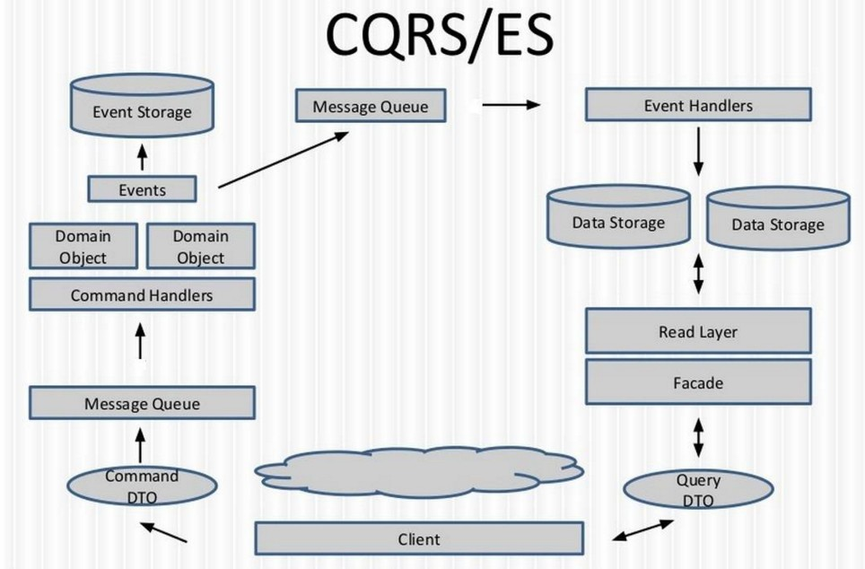

CQRS本身只是一个读写分离的思想，全称是：Command Query Responsibility Segregation，即命令查询职责分离。一个命令表示一种意图，表示命令系统做什么修改，命令的执行结果通常不需要返回；一个查询表示向系统查询数据并返回。
另外一个重要的概念就是事件，事件表示领域中的聚合根的状态发生变化后产生的事件，基本对应DDD中的领域事件；

CQRS架构的核心出发点是将整个系统的架构分割为读和写两部分，从而方便我们对读写两端进行分开优化；

CQRS架构的一致性模型为最终一致性。

采用CQRS架构的一个前提是，你的系统要接受系统使用者查询到的数据可能不是最新的，而是有几个毫秒的延迟。之所以会有这个前提，是因为CQRS架构考虑到，作为一个多用户同时访问的互联网应用，当在高并发修改数据的情况下，比如秒杀、12306购票等场景，用户UI上看到的数据总是旧的。比如你秒杀时提交订单前看到库存还大于0，但是当你提交订单时，系统提示你宝贝卖完了。这个就说明，在这种高并发修改同一资源的情况下，任何人看到的数据总是Stale的，即旧的。

### CQRS作为一种架构思想，可以有多种实现方式：

- 最常见的CQRS架构是数据库的读写分离；
- 系统底层存储不分离，但是上层逻辑代码分离；
- 系统底层存储分离，C端采用Event Sourcing的技术，在EventStore中存储事件；Q端存储对象的最新状态，用于提供查询支持；

### CQRS架构的适用场景：

- 当我们的应用的写模型和读模型差别比较大时；
- 当我们希望实践DDD时；因为CQRS架构可以让我们实现领域模型不受任何ORM框架带来的对象和数据库的阻抗失衡的影响；
- 当我们希望对系统的查询性能和写入性能分开进行优化时，尤其是读/写比非常高的系统，CQ分离是必须的；
- 当我们希望我们的系统同时满足高并发的写、高并发的读的时候；因为CQRS架构可以做到C端最大化的写，Q端非常方便的提供可扩展的读模型；

今天想主要分享的CQRS架构是上面第3种场景，也就是上图所画的架构。在我心目中，只有第三种才是真正意义上的CQRS架构。

### C端的命令执行流程

下面简单描述一下上面的CQRS架构的数据流，客户端如（MVC Controller）发送命令通知系统做修改：

1. 发送命令到分布式MQ；
1. 然后命令的订阅者处理命令；
1. 订阅者内部根据不同的命令调用不同的Command Handler进行处理；
1. Command Handler内部根据命令所指定的聚合根ID从In-Memory内存中直接获取聚合根对象的引用，然后操作聚合根对象；
1. 聚合根对象状态发生变化并产生事件；
1. 框架负责自动持久化事件到Event Storage（简称EventStore）；
1. 框架负责将事件发布到Event MQ；
1. Event订阅者订阅事件，然后调用对应的Event Handler进行处理，如更新Data Storage（保存了聚合根的最新状态，通常叫读库，ReadDB）；

### Q端的查询执行流程

客户端如（MVC Controller）发出查询请求系统返回数据：

- 调用轻薄的Query Service，传如Query DTO；
- Query Service从读库进行查询并返回结果；

读库可以有很多种，依据我们的业务场景来选择：比如关系型DB、分布式缓存等NoSQL、搜索引擎等。

- 遵守一个原则：一个命令只允许修改一个聚合根；
- 命令或事件在分布式MQ的路由根据聚合根ID来路由，也就是同一个聚合根的命令和事件都在一个队列里；
- 引入Command Mailbox，Event Mailbox这两个概念，将聚合根需要处理的命令和产生的事件都队列化，去并发；做到架构上最大的并行，将并发降低到最低；
- 引入Group Commit技术，做到整个C端的架构层面支持批量提交聚合根产生的事件，从而极大的提高C端的整体吞吐量；比如可以实现对同一个聚合根的每秒修改TPS达到5W？这个在传统的架构下是很难做到的。而在这个架构下，框架就可以提供支持。
- 通过引入Saga（不了解的同学可以网上搜一下什么是CQRS Saga）的概念，做到基于事件驱动的最终一致性，大家可以回想一下前面介绍的Node通过Event连接的架构；整个系统的所有节点的交互通过消息来驱动；
- 

#### 参考
深度长文：我对CQRS/EventSourcing架构的思考