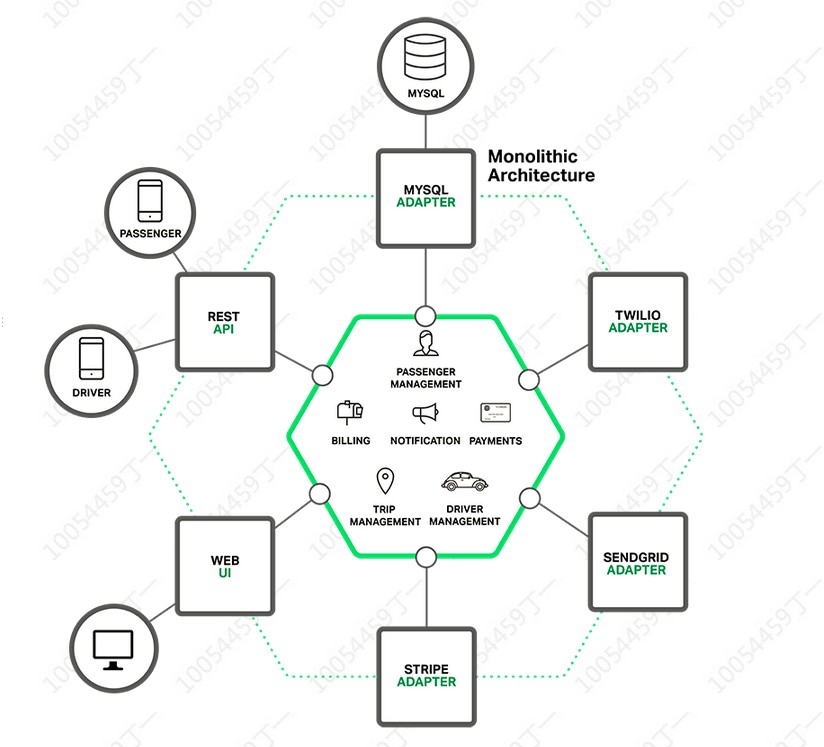

## 六边形架构的起源
六边形架构（Hexagonal Architecture），又称为端口和适配器架构风格，其中的“六”具体数字没有特殊的含义，仅仅表示一个“量级”的意思，六边形的定义只是方便更加形象的理解。
六边形架构是由Alistair Cockburn提出，原始文章：http://alistair.cockburn.us/Hexagonal+architecture。

- **领域层**（Domain Layer）：最里面，纯粹的核心业务逻辑，一般不包含任何技术实现或引用。
- **端口层**（Ports Layer）：领域层之外，负责接收与用例相关的所有请求，这些请求负责在领域层中协调工作。端口层在端口内部作为领域层的边界，在端口外部则扮演了外部实体的角色。
- **适配器层**（Adapters Layer）：端口层之外，负责以某种格式接收输入、及产生输出。比如，对于 HTTP 用户请求，适配器会将转换为对领域层的调用，并将领域层传回的响应进行封送，通过 HTTP 传回调用客户端。在适配器层不存在领域逻辑，它的唯一职责就是在外部世界与领域层之间进行技术性的转换。适配器能够与端口的某个协议相关联并使用该端口，多个适配器可以使用同一个端口，在切换到某种新的用户界面时，可以让新界面与老界面同时使用相同的端口。

在六边形架构中，领域层和技术没半毛钱关系，可以看作是业务的技术实现，端口层包裹在领域层在外，外部要向和领域层“交流”，则必须通过端口层的“首肯”，反过来，领域层向外面“交流”也是一样，但这种方式一般是技术上的，比如领域对象的管理：

