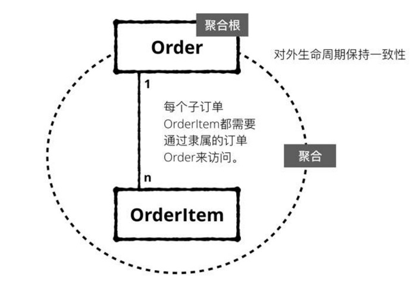

## 概述
战略设计和战术设计是DDD两种不同的建模视角。
战略设计偏高层设计，宏观划分领域和识别限界上下文。
战术设计偏重实现层面，用建模工具细化限界上下文。

## 战略设计
### 子域和限界上下文
子域也叫子问题域，是针对业务能力的分解。

限界上下文是软件对于问题域的一个特定的，有限的解决方案。

一个限界上下文封装了一个相对独立子领域的领域模型和服务。限界上下文地图描述了各个子领域之间的集成调用关系。这个定义某种意义上和我们的微服务划分不谋而合：以提供业务能力为导向的、自治的、独立部署单元。所以虽然我们不能百分百依据限界上下文划分服务，但限界上下文，或者说是DDD，绝对是我们设计微服务架构的重要方法之一。

DDD通过子问题域（subdomain）的划分就已经进行了针对业务能力的分解，而限界上下文在解决方案域中完成了进一步分解。当然我们不能完全认为子问题域和限界上下文有严格意义上的一对一关系，但大多数情况下一个子问题域是会被设计成一个或多个限界上下文的。子域subdomain和限界上下文某种意义上是互相印证的，重点在区分问题域和解决方案域，这是落地DDD最困难的地方，也是判断一个架构师能力进阶的分水岭。

### 限界上下文间的关系
防腐层：可以使用适配器或者facade模式。

## 战术设计

### 实体
- 唯一id
- 可修改

可以把setter/getter方法，重命名为更符合领域模型的术语。
比如Tenant具有激活和去激活的行为，则把setter/getter方法改为active()和deactive()更合适。

### 值对象
- 状态无关
- 不可修改(不变)

常见值对象举例：颜色、身高

### 聚合
聚合定义了一组具有内聚关系的相关对象的集合，我们把聚合看作是一个修改数据的最小原子单元。

聚合根，每个聚合都有一个根对象，根对象管理聚合内的其他子对象（实体、值对象）；聚合之间的交互都是通过聚合根来交互，不能绕过聚合根去直接和聚合下的子实体进行交互。

上面的例子中，Car、Wheel、Position、Tire四个对象构成一个聚合，其中Car是聚合根；Customer也是聚合根，Customer不能直接访问Car下的Tire（子实体），而是只能通过聚合根Car来访问。

上面表达了一个关于聚合的一致性设计原则：聚合内的数据修改，是ACID强一致性的；跨聚合的数据修改，是最终一致性的。遵守这个原则，可以让我们最大化的降低并发冲突，从而最大化的提高整个系统的吞吐。

聚合设计原则：
- 设计小聚合。大部分聚合可能只有根实体。
- 通过唯一ID引用其他聚合。
- 边界内的内容具有强强一致性，在边界之外使用最终一致性。

在DDD中有一条原则：一个业务用例对应一个事务，一个事务对应一个聚合根，也即在一次事务中，只能对一个聚合根进行操作。  

#### 一个聚合例子
比如我们以订单跟踪领域为例，假设我们允许一个订单下存在多个子订单，而每个子订单也是可以独立配送的，这种情况下我们抽象出“子订单”这个实体。显然订单和子订单存在业务逻辑上的一致性，没有订单的时候不应该创建子订单，更新子订单的时候应该同时“通知”所属的订单。这个时候如果采用把订单和子订单聚合起来的封装就很有必要了。

采用聚合抽象的结果就是访问每个子订单都需要从相关的订单入口（i.e., 订单为聚合根），存取时我们都是以这个聚合为基本单位，即包含了订单和订单下面的所有子订单。显然这样的好处是在订单跟踪这个领域模型里，订单作为一个聚合存在，我们只需要一次性梳理清楚订单和子订单的逻辑关系，就不需要在未来每次引用时都考虑这里面的业务规则了。

### 资源库
资源库和聚合是一一对应的。实体和值对象不需要资源库。
领域对象需要资源存储，而存储介质不仅限于数据库，比如内存，缓存，文本都有可能。所以资源库屏蔽了这种差异。让领域对象的存储无感知。
比如com.company.bussiness.repo.dao.* // 数据库
com.company.bussiness.repo.cache.* // 缓存

让我们再回到订单跟踪这个例子，通知订单状态发生变化的服务在发出通知前，需要定位到订单的信息（可能包括订单的相关干系人和子订单的信息）。通知作为一个服务是不应该持有具体订单信息的，这个时候我们就需要通过Repositories的抽象来建立对订单这个聚合的查询，即有一个订单的repo，而具体的查询逻辑应该在这个repo中。

#### repo和dao的区别？<待补充>

### 领域服务和应用服务
当某个操作不合适放在Entity和VO中时，就需要考虑领域服务了。
领域服务恰恰处理的是业务逻辑，也就是说可以处理多个领域对象。

一个经典的例子是在账户管理领域里对“转账”这个业务行为的抽象。由于转账本身是作用在至少两个账户上的，所以把转账作为一个账户的行为显然是不合适的。那么如果我们把转账名词化抽象成一个实体呢？感觉也是比较别扭，毕竟转账是依附于账户存在的。

这个时候DDD在元模型里提出了服务（Service）这个抽象，转账被抽象为一个服务感觉就顺畅多了。同样道理，在我们上面的订单跟踪领域里，如果跟踪的过程中需要进行短信的通知，一个比较好的建模就是抽象出一个“通知”服务来完成。

服务本身就像一个静态方法一样，拥有一定的逻辑但不持有任何的信息，从整个领域来看也不存在不同“版本”的同一个服务。

### 应用服务
应用服务不会处理业务逻辑，他会处理多个领域服务。

应用服务直接对外部提供接口。如果存在这样的分层，那么领域服务就不应该直接对外，而应该通过应用服务。

举个例子，前面的订单消息通知如果是一个领域服务，在完成订单状态变化时创建通知消息，而最后的通知以短信的方式发给设定的人群，这样就应该有一个相应的应用服务，包含了具体的业务场景处理逻辑。之后也可能有一个邮件通知的应用服务，同样调用了这个通知领域服务，但通过邮件渠道来完成最终的业务场景。

### 领域事件
Event Sourcing（事件溯源）
因为是用事件来表示对象的状态，而事件是只会增加不会修改。这就能让数据库里的表示对象的数据非常稳定，不可能存在DELETE或UPDATE等操作。因为一个事件就是表示一个事实，事实是不能被磨灭或修改的。这种特性可以让领域模型非常稳定，在数据库级别不会产生并发更新同一条数据的问题。

## 实例
### 领域驱动设计的一般步骤

- 根据需求初步划分出领域和限界上下文，以及上下文间的关系。
- 分析每个限界上下文，找到实体和值对象。
- 对实体和值对象进行关联和聚合，找到聚合和聚合根。
- 为聚合设计仓储，并思考实体或值对象的创建方式。
- 在工程中实践领域模型，并检验模型的合理性并重构。

### 一些原则
上下文的划分尽量满足高内聚和低耦合。一般一个module对应一个限界上下文。
和团队的关系？ 这样系统的边界确定后，团队易于承接开发任务。

## 参考
在微服务中使用领域事件   滕云

