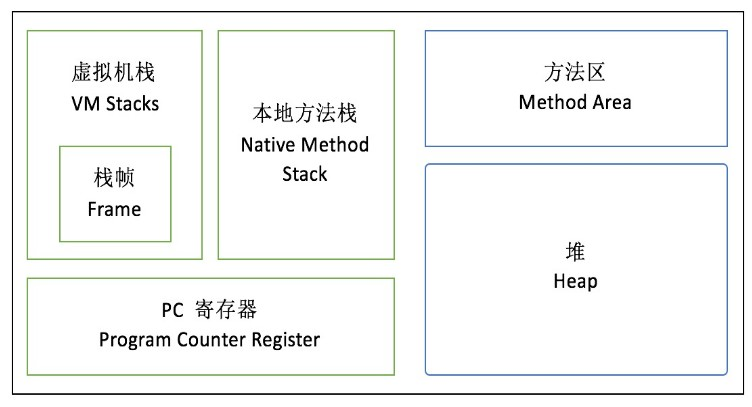
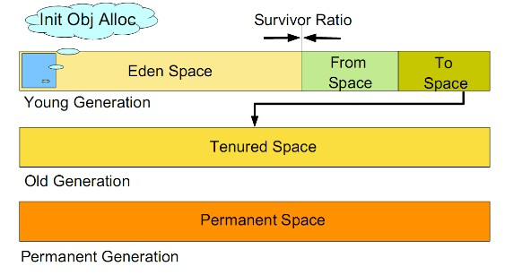
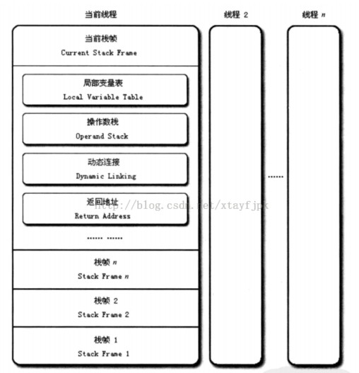
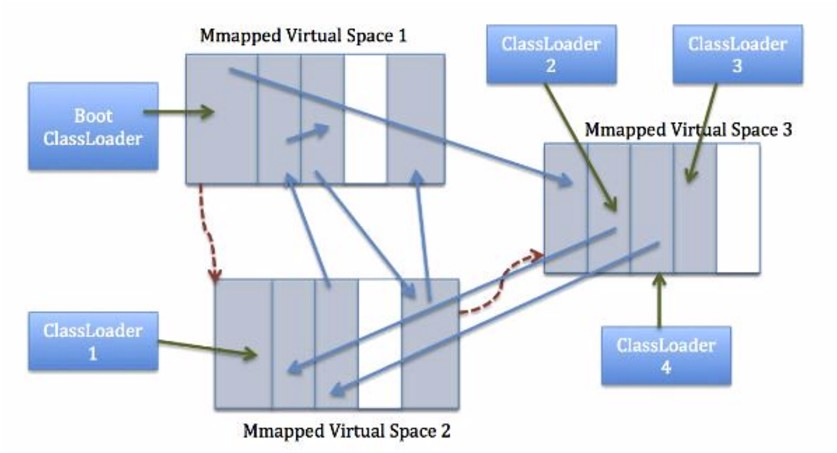

**修订记录**

| 时间 | 内容 |
|--------|--------|
| 2017.07.29 |  初稿 |

## 1.概述
JVM内存模型，也即运行时数据区由以下五部分组成：


- 堆
- 虚拟机栈
- 本地方法栈
- 方法区
- 程序计数器

其中，堆、方法区是线程共享的，虚拟机栈、Native栈、程序计数器是线程私有的。

## 2.堆(Heap)
几乎所有对象实例和数组都要在堆上分配，因此是VM管理的最大一块内存, 也是垃圾收集器的主要活动区域。

由于现代VM采用分代收集算法, 因此Java堆从GC的角度还可以细分为: 新生代(Eden区、From Survivor区和To Survivor区)和老年代; 而从内存分配的角度来看, 线程共享的Java堆还还可以划分出多个线程私有的分配缓冲区(TLAB)。 而进一步划分的目的是为了更好地回收内存和更快地分配内存。

按照虚拟机规范，堆可以处在物理上不连续的内存空间上，只要逻辑连续即可。如果内存空间不足，会报OutOfMemoryError。



### 2.1 新生代
所有新生成的对象首先都是放在新生代的。新生代的目标就是尽可能快速的收集掉那些生命周期短的对象。

新生代分三个区：一个Eden区，两个Survivor区。大部分对象在Eden区中生成。当Eden区满时，还存活的对象将被复制到Survivor区（两个中的一个），当这个Survivor区满时，此区的存活对象将被复制到另外一个Survivor区，当这个Survivor也满了的时候，从第一个Survivor区复制过来的并且此时还存活的对象，将被复制“老年代(Tenured)”。

需要注意，Survivor的两个区是对称的，没先后关系，所以同一个区中可能同时存在从Eden复制过来对象，和从前一个Survivor复制过来的对象，而复制到老年代的只有从第一个Survivor去过来的对象。而且，Survivor区总有一个是空的。

### 2.2 老年代
下列情况，对象会被移至老年代：

- 在新生代中经历了N次垃圾回收后仍然存活的对象
- 大对象超过了PretenureSizeThreshold预设值。

因此，老年代一般存放生命周期较长或者大对象。它的内存容量一般较大，内存不足时触发full gc。

### 2.3 永久代
见后面的方法区。

## 2.Java虚拟机栈（JVM Stack）

虚拟机栈描述的是Java方法执行的内存模型: 每个方法被执行时会创建一个栈帧(Stack Frame)用于存储局部变量表、操作数栈、动态链接、返回地址等信息。每个方法被调用至返回的过程, 就对应着一个栈帧在虚拟机栈中从入栈到出栈的过程(VM提供了-Xss来指定线程的最大栈空间, 该参数也直接决定了函数调用的最大深度)。

栈的大小可以用-Xss参数控制，如果栈深不够，会报StackOverflowError。
如果栈的内存不足，会报OutOfMemoryError。

### 2.1 栈帧（Frame）
每次方法调用都会新建一个新的栈帧并把它压栈到栈顶。当方法正常返回或者调用过程中抛出未捕获的异常时，栈帧将出栈。除了栈帧的压栈和出栈，栈不能被直接操作。

每个栈帧包含：

- 局部变量表
- 操作数栈
- 动态链接
- 返回地址



#### 2.1.1 局部变量表
局部变量表包含了方法执行过程中的所有变量，包括 this 引用、所有方法参数、其他局部变量。它由数组构成。
对于类方法（也就是静态方法），方法参数从下标 0 开始；对于对象方法，位置0保留为 this。

包括如下变量类型：

1. boolean
1. byte
1. short
1. char
1. long
1. int
1. float
1. double
1. reference
1. returnAddress


局部变量表的容量单位是Slot，4个字节，32位 。因此，除了long和double类型以外，所有的变量类型都占用一个slot。long和 double需要占用两个连续的slot。

#### 2.1.2.操作数栈
操作数栈用于存储字节码执行过程中的操作数。当一个方法刚开始执行时，其操作数栈是空的，方法在执行的过程中会有各种字节码指令往操作数栈中写入或读取操作数。举例来说，当执行一个整数加法的指令iadd时，执行引擎会将操作数栈栈顶的两个元素取出（出栈），相加获得结果后再压入栈。

> int i;

被编译成下面的字节码：

>0:    iconst_0    // 把0压入操作数栈顶
>1:    istore_1    // 从操作数栈顶取出元素0并存储到局部变量表中1

#### 2.1.3.动态链接
每个栈帧都包含一个指向运行时常量池中该栈帧所属方法的引用，持有这个引用是为了支持方法调用过程中的动态连接。在Class文件的常量池中存有大量的符号引用，字节码中的方法调用指令就以常量池中指向方法的符号引用为参数。这些符号引用一部分会在类加载阶段或第一次使用的时候转化为直接引用，这种转化称为静态解析。另外一部分将在每一次的运行期期间转化为直接引用，这部分称为动态连接。

#### 2.1.4.返回地址
当一个方法执行完成后有两种返回方式：

- 正常返回：执行引擎执行到任意一个返回的字节码指令
- 异常返回：在方法执行过程中遇到异常而退出。异常包括虚拟机内部异常以及代码中使用athrow字节码抛出的异常

无论以何种方式返回，方法退出前都需要回到方法被调用的位置。一般来说方法正常退出时，调用者PC计数器的值即为返回地址；异常退出时，返回地址通过异常处理器来确定。

## 3.本地方法栈(Native Stack)
什么是本地方法(Native Method)？

简单地讲，一个Native Method就是一个java调用非java代码的接口，它为我们提供了一个非常简洁的接口，而且我们无需去了解java应用之外的繁琐的细节。

如下是一个本地方法的例子：

```java
 public class IHaveNatives {

      native public void Native1( int x ) ;

      native static public long Native2() ;

      native synchronized private float Native3( Object o ) ;

      native void Native4( int[] ary ) throws Exception ;

 } 

```

为什么会调非Java的代码？主要是由于JVM可能会和底层操作系统交互，操作系统的库函数很有可能是C或者其他非Java语言实现的。
本地方法栈的作用和虚拟机栈的作用非常类似，只不过是针对本地方法进行的操作。
虚拟机规范没有对本地方法栈的实现语言、使用方式、数据结构做要求，所以具体的虚拟机可以自由实现。

和虚拟机栈一样，本地方法栈也会抛出StackOverflowError和OutOfMemoryError。

## 4.方法区
即我们常说的永久代(Permanent Generation), 它是一段连续的内存空间，用于存储被JVM加载的类信息、常量、静态变量、即时编译器编译后的代码等数据。它还有个别名叫：非堆(non-heap)，意思也就是能和堆区分开。

HotSpot VM把GC分代收集扩展至方法区, 即使用Java堆的永久代来实现方法区, 这样HotSpot的垃圾收集器就可以像管理Java堆一样管理这部分内存, 而不必为方法区开发专门的内存管理器(永久带的内存回收的主要目标是针对常量池的回收和类型的卸载, 因此收益一般很小)

可以通过设置-XX:MaxPermSize的值来控制永久代的大小，32位机器默认的永久代的大小为64M，64位的机器则为85M。

永久代的垃圾回收和老年代的垃圾回收是绑定的，一旦其中一个区域被占满，这两个区都要进行垃圾回收。但是有一个明显的问题，由于我们可以通过‑XX:MaxPermSize 设置永久代的大小，一旦类的元数据超过了设定的大小，程序就会耗尽内存，并出现内存溢出错误(OOM)。

不过在1.7的HotSpot已经将原本放在永久代的字符串常量池移出。
而在1.8中, 永久区已经被彻底移除, 取而代之的是元空间Metaspace。（详细可参看后面的“元空间”一节）

### 4.1.Classloader 引用
所有的类加载之后都包含一个加载自身的加载器的引用，反过来每个类加载器都包含它们加载的所有类的引用。

### 4.2.运行时常量池
它用于存放编译期生成的各种字面量和符号引用, 这部分内容会存放到方法区的运行时常量池中。但Java语言并不要求常量一定只能在编译期产生, 即并非预置入Class文件中常量池的内容才能进入方法区运行时常量池, 运行期间也可能将新的常量放入池中, 如String的intern()方法。

字面量包括：

- 类名
- 变量名称和值（实例、静态变量）
- 常量名臣和值
- 方法名
- 属性名

符号引用，像 #2, #13...

如下代码：

```java
Object foo = new Object();

```

编译成字节码：

```java
0:    new #2             // Class java/lang/Object
1:    dup
2:    invokespecial #3    // Method java/ lang/Object "&lt;init&gt;"( ) V
```

new 操作码的后面紧跟着操作数 #2 。这个操作数是常量池的一个索引，表示它指向常量池的第二个实体。第二个实体是一个类的引用，这个实体反过来引用了另一个在常量池中包含 UTF8 编码的字符串类名的实体（// Class java/lang/Object）。然后，这个符号引用被用来寻找 java.lang.Object 类。new 操作码创建一个类实例并初始化变量。新类实例的引用则被添加到操作数栈。

dup 操作码创建一个操作数栈顶元素引用的额外拷贝。最后用 invokespecial 来调用第 2 行的实例初始化方法。操作码也包含一个指向常量池的引用。初始化方法把操作数栈出栈的顶部引用当做此方法的一个参数。最后这个新对象只有一个引用，这个对象已经完成了创建及初始化。

### 4.3.字段数据

- 字段名
- 类型
- 修饰符
- 属性（Attribute）


### 4.4.方法数据

- 方法名
- 返回值类型
- 参数类型（按顺序）
- 修饰符
- 属性


### 4.5.方法代码

- 字节码
- 操作数栈大小
- 局部变量大小
- 局部变量表

### 4.6.异常表
异常表像这样存储每个异常处理信息：

- 开始点
- 结束点
- 异常处理代码的程序计数器（PC）偏移量
- 被捕获的异常类对应的常量池下标

如果一个方法有定义 try-catch 或者 try-finally 异常处理器，那么就会创建一个异常表。它为每个异常处理器和 finally 代码块存储必要的信息，包括处理器覆盖的代码块区域和处理异常的类型。

当方法抛出异常时，JVM 会寻找匹配的异常处理器。如果没有找到，那么方法会立即结束并弹出当前栈帧，这个异常会被重新抛到调用这个方法的方法中（在新的栈帧中）。如果所有的栈帧都被弹出还没有找到匹配的异常处理器，那么这个线程就会终止。如果这个异常在最后一个非守护进程抛出（比如这个线程是主线程），那么也有会导致 JVM 进程终止。

Finally 异常处理器匹配所有的异常类型，且不管什么异常抛出 finally 代码块都会执行。在这种情况下，当没有异常抛出时，finally 代码块还是会在方法最后执行。这种靠在代码 return 之前跳转到 finally 代码块来实现。

### 4.7.其他

所有线程共享同一个方法区，因此访问方法区数据的和动态链接的进程必须线程安全。如果两个线程试图访问一个还未加载的类的字段或方法，必须只加载一次，而且两个线程必须等它加载完毕才能继续执行。

Oracle JVM 的 jconsle 显示方法区和 code cache 区被当做为非堆内存，而 OpenJDK 则显示 CodeCache 被当做 VM 中对象堆（ObjectHeap）的一个独立的域。

## 5.程序计数器(PC)
一块较小的内存空间, 作用是当前线程所执行字节码的行号指示器。在JVM模型中, 字节码解释器就是通过改变PC值来选取下一条需要执行的字节码指令，分支、循环、跳转、异常处理、线程恢复等基础功能都需要依赖PC完成。

- 如果线程正在执行的是一个Java方法，则PC记录的是虚拟机字节码指令的地址。
- 如果执行的是Native方法，则PC的值为空(Undefined)。

不同于OS以进程为单位调度, JVM中的并发是通过线程切换并分配时间片执行来实现的. 在任何一个时刻, 一个处理器内核只会执行一条线程中的指令。因此, 为了线程切换后能恢复到正确的执行位置, 每条线程都需要有一个独立的程序计数器, 这类内存被称为“线程私有”内存。

这块内存区域也是虚拟机规范 **唯一没有定义OutOfMemoryError异常的区域**。

## 6.元空间
在JDK8之前，类的元数据和常量都存放在一个与堆内存相邻的数据区，即永久代。但是在这种情况下有一个问题，如果类的元数据大小超过了应用的可分配内存，那么就会出现内存溢出问题。

在JDK8之后，永久代被移除，原本存储在永久代的数据将存放在一个叫做元空间的本地内存区域。

![ ]images/元空间.jpg)
元空间是存储在本地内存的。

### 6.1.元空间的容量

1. 默认情况下，类元数据只受可用的本地内存限制。
1. 参数MaxMetaspaceSize用于限制本地内存分配给类元数据的大小。如果没有指定这个参数，元空间会在运行时根据需要动态调整。
1. 如果GC发现某个类加载器不再存活了，会把相关的空间整个回收掉。

### 6.2.元空间的内存管理
元空间的内存管理由元空间虚拟机来完成。只要类加载器存活，其加载的类的元数据也是存活的，因而不会被回收掉。

元空间虚拟机负责元空间的分配，其采用的形式为组块分配。组块的大小因类加载器的类型而异。在元空间虚拟机中存在一个全局的空闲组块列表。当一个类加载器需要组块时，它就会从这个全局的组块列表中获取并维持一个自己的组块列表。当一个类加载器不再存活，那么其持有的组块将会被释放，并返回给全局组块列表。类加载器持有的组块又会被分成多个块，每一个块存储一个单元的元信息。组块中的块是线性分配（指针碰撞分配形式）。组块分配自内存映射区域。这些全局的虚拟内存映射区域以链表形式连接，一旦某个虚拟内存映射区域清空，这部分内存就会返回给操作系统。


上图中，类加载器1和3使用了特定大小组块。 而类加载器2和4使用小型或者中型的组块。

### 6.3.元空间调优
对于一个64位的服务器端JVM来说，其默认的–XX:MetaspaceSize值为21MB。这就是初始的高水位线。一旦触及到这个水位线，Full GC将会被触发并卸载没有用的类（即这些类对应的类加载器不再存活），然后这个高水位线将会重置。新的高水位线的值取决于GC后释放了多少元空间。如果释放的空间不足，这个高水位线则上升。如果释放空间过多，则高水位线下降。如果初始化的高水位线设置过低，上述高水位线调整情况会发生很多次。通过垃圾回收器的日志我们可以观察到Full GC多次调用。
经过多次GC之后，元空间虚拟机自动调节高水位线，以此来推迟下一次垃圾回收到来。

#### 6.4.MaxMetaspaceSize的调优

- -XX:MaxMetaspaceSize={unlimited}
- 元空间的大小受限于你机器的内存
- 限制类的元数据使用的内存大小，以免出现虚拟内存切换以及本地内存分配失败。如果怀疑有类加载器出现泄露，应当使用这个参数；32位机器上，如果地址空间可能会被耗尽，也应当设置这个参数。
- 元空间的初始大小是21M——这是GC的初始的高水位线，超过这个大小会进行Full GC来进行类的回收。
- 如果启动后GC过于频繁，请将该值设置得大一些
- 可以设置成和持久代一样的大小，以便推迟GC的执行时间


### 6.5.相关工具
1.jmap -clstats PID 打印类加载器数据。（-clstats是-permstat的替代方案，在JDK8之前，-permstat用来打印类加载器的数据）。

2.jstat -gc PID 用来打印元空间的信息

```java
# jstat -gc 1
 S0C    S1C    S0U    S1U      EC       EU        OC         OU       MC     MU
   CCSC   CCSU   YGC     YGCT    FGC    FGCT     GCT
3584.0 3584.0 1974.9  0.0   265728.0 98818.8   546304.0   25537.1   53504.0 5165
8.1 6656.0 6380.1     58    0.869   1      0.374    1.243
```
其中MC, MU的值就是元空间的信息。
MC：Metaspace Capacity(KB)  当前元空间大小
MU: Metaspace Utilization(KB)  元空间使用

3.jcmd PID GC.class_stats 一个新的诊断命令，用来连接到运行的JVM并输出详尽的类元数据的柱状图。

### 6.6.存在的问题
由于元空间虚拟机采用了组块分配的形式，同时区块的大小由类加载器类型决定。类信息并不是固定大小，因此有可能分配的空闲区块和类需要的区块大小不同，这种情况下可能导致碎片存在。元空间虚拟机目前并不支持压缩操作，所以碎片化是目前最大的问题。
