**修订记录**

| 时间 | 内容 |
|--------|--------|
| 2017.08.16 | 初稿 |

## 虚拟机栈
我们知道，在JVM内存模型中，虚拟机栈是由栈帧组成的。 
每个栈帧包含：

- 局部变量表
- 操作数栈
- 动态链接
- 返回地址

## 方法调用
方法调用不是方法执行，方法调用的唯一任务就是确定方法执行的版本，并不涉及具体方法的执行。Class文件在编译的过程中并不包含传统编译中的连接，一切方法调用在编译期间只是符号引用而不是方法在实际执行时的内存地址入口。

方法调用主要分为两种：

- 解析调用
- 分派调用

### 1.解析调用
所有方法调用的目标方法在Class文件中都只是一个符号引用，在类加载的过程中会将其中一部分符号引用转换成直接引用，能够转换的前提是：该方法在编译时即可确定其调用的版本，且该方法在运行期间是不会改变的。上述解析过程称为静态解析，而与之相对应的就是动态解析。符合静态解析标准的方法主要有以下几种：

- 私有方法
- 静态方法
- 父类方法
- 被final修饰的方法

可以看出，上述几种方法都是不支持覆写的，所以在编译期即可确认其执行版本，因而支持静态解析。

Java虚拟机一共提供了5个方法调用的指令：

| 指令 | 描述 |
|--------|--------|
| invokestatic    |  调用静态方法      |
| invokespecial       |  调用实例构造器方法，私有方法和父类方法      |
| invokevirtual       |  调用实例方法      |
| invokeinterface       |  调用接口方法，会在运行时再确定一个实现此接口的对象      |
| invokedynamic       |  先在运行时动态解析出调用点限定符所引用的方法，然后再执行该方法      |

invokestatic,invokespecial两个指令所调用的方法都是在编译期即可确定其唯一调用版本，符合这个条件的有静态方法，私有方法，实例构造器和父类方法四类。它们在类加载的时候就会把符号引用解析为该方法的直接引用。这些方法可以统称为非虚方法，与之相反，其它方法就称为虚方法。

虽然final方法是使用invokevirtual指令来调用的，但是由于它无法被覆盖，在Java语言规范中明确说明了final方法是一种非虚方法。

### 2.分派调用
分派调用分为静态分派和动态分派。

#### 静态分派
静态分派多发生在方法的重载(overload)上，来看下下面这个例子：

```java
public class StaticDispatch {
    static abstract class Human {
    }
	
    static class Man extends Human {
    }
	
    static class Woman extends Human {
    }  

    public void sayHello(Human guy) {  
        System.out.println("hello guy...");  
    }  
	
    public void sayHello(Man man) {  
        System.out.println("hello man...");  
    }

    public void sayHello(Woman woman) {  
        System.out.println("hello woman...");  
    }

    public static void main(String[] args) {  
        Human man = new Man();  
        Human woman = new Woman();  
        StaticDispatch sd = new StaticDispatch();  
        sd.sayHello(man);  
        sd.sayHello(woman);  
    }  
}
```

执行结果为：

>hello guy...
>hello guy...

为什么虚拟机执行的是public void sayHello(Human guy)呢？这里需要解释一个概念，首先来看下main方法中的前两行代码:

```java
Human man = new Man();  
Human woman = new Woman();  
```

一个实例对象有静态类型和实际类型两个类型，静态类型在编译时即确定，而实际类型则需要到运行时才可确定。上述两个变量的静态类型均为Human，而实际类型则为Man和Woman。

静态类型在编译时即可确定并不是说静态类型不可改变，下面两行代码即可改变静态类型：

```java
sd.sayHello((Man)man);  
sd.sayHello((Woman)woman);  
```

由于虚拟机在编译重载方法调用指令时是通过参数的静态类型进行选择的，并且静态类型是在编译期即可确定的，所以在上述的例子中虚拟机执行的方法是public void sayHello(Human guy)。

#### 动态分派
动态分派即在运行时才确定方法执行的具体版本并进行分派。动态分派最典型的场景就是：方法重写(override)。

```java
public class DynamicDispatch {
    static abstract class Human {  
        protected abstract void sayHello();  
    }  
    static class Man extends Human {  
        @Overrideprotected void sayHello() {  
            System.out.println("man say hello");              
        }  
    }  
    static class Woman extends Human {  
        @Overrideprotected void sayHello() {  
            System.out.println("woman say hello");  
        }  
    }  

    public static void main(String[] args) {  
        Human man = new Man();  
        Human woman = new Woman();  
        man.sayHello();  
        woman.sayHello();  
        man = new Woman();  
        man.sayHello();  
    }  
}
```

运行结果：

>man say hello
>woman say hello
>woman say hello

在上述代码中，两个静态类型均为Human的对象调用相同的方法却实际上并没有执行相同的方法，说明其方法的分派并不是通过静态类型来确定，而是根据两个变量的实际类型来确定的。Java虚拟机是如何利用实际类型来分派方法的执行版本的呢？来看看上述代码的字节码：

```java
public static void main(java.lang.String[]);  
  flags: ACC_PUBLIC, ACC_STATIC  
  Code:  
    stack=2, locals=3, args_size=10: new          
       4: invokespecial #18      // Method DynamicDispatch$Man."<init>":()V  
       7: astore_1  
       8: new           #19      // class DynamicDispatch$Woman  11: dup  
      12: invokespecial #21      // Method DynamicDispatch$Woman."<init>":()V  
      15: astore_2  
      16: aload_1  
      17: invokevirtual #22      // Method DynamicDispatch$Human.sayHello:()V  
      20: aload_2  
      21: invokevirtual #22      // Method DynamicDispatch$Human.sayHello:()V  
      24: new           #19      // class DynamicDispatch$Woman  27: dup  
      28: invokespecial #21      // Method DynamicDispatch$Woman."<init>":()V  
      31: astore_1  
      32: aload_1  
      33: invokevirtual #22      // Method DynamicDispatch$Human.sayHello:()V  
      36: return
```

第4-7行，是实例化对象，并存储到局部变量表中。12-15行，是实例化另一个对象。
第16和第20两行分别把刚刚创建的两个对象的引用压到栈顶，这两个对象是将执行的sayHello()方法的所有者，称为接收者(Receiver)，第17和第21两行是方法调用指令，单从字节码的角度来看，这两条调用指令无论是指令(都是invokevirtual)还是参数(都是常量池中Human.sayHello()的符号引用)都完全一样，但是这两条指令最终执行的目标方法并不相同，其原因需要从invokevirutal指令的多态查找过程开始说起，invokevirtual指令的运行时解析过程大致分为以下步骤：

1. 找到操作数栈顶的第一个元素所指向的对象实际类型，记作C。
1. 如果在类型C中找到与常量中描述符和简单名称都相同的方法，则进行访问权限校验，如果通过则返回这个方法的直接引用，查找结束；不通过则返回java.lang.IllegalAccessError错误。
1. 否则，按照继承关系从下往上依次对C的各个父类进行第2步的搜索与校验过程。
1. 如果始终没有找到合适的方法，则抛出java.lang.AbstractMethodError错误。

由于invokevirtual指令执行的第一步就是在运行期确定接收者的实际类型，所以两次调用中的invokevirtual指令把常量池中的类方法符号引用解析到了不同的直接引用上，这个过程就是Java语言中方法重写的本质。我们把这种在运行期根据实际类型确定方法执行版本的分派过程称为动态分派。

## 案例1
《深入理解Java虚拟机》一书中的例子：

如下的代码：
```java
public class ClassResolvor {
  public int calc() {
    int a = 100;
    int b = 200;
    int c = 300;
    return (a + b) * c;
  }
}
```

生成的字节码如下：
```java
  public int calc();
    descriptor: ()I
    flags: ACC_PUBLIC
    Code:
      stack=2, locals=4, args_size=1
         0: bipush        100
         2: istore_1
         3: sipush        200
         6: istore_2
         7: sipush        300
        10: istore_3
        11: iload_1
        12: iload_2
        13: iadd
        14: iload_3
        15: imul
        16: ireturn
```

字节码执行的过程如下：

#### 执行偏移地址为0的指令
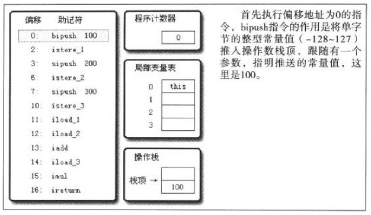

#### 执行偏移地址为1的指令
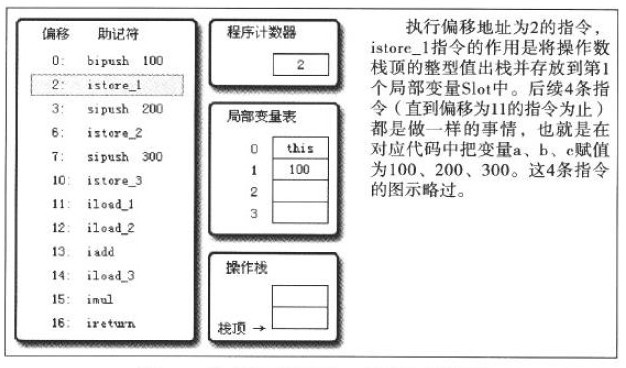

#### 执行偏移地址为11的指令
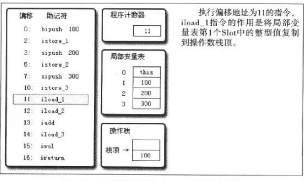

#### 执行偏移地址为12的指令
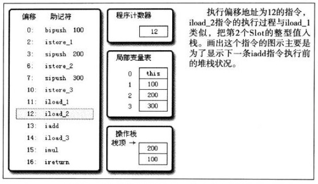

#### 执行偏移地址为13的指令
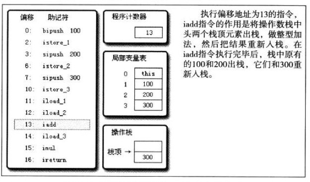

#### 执行偏移地址为14的指令
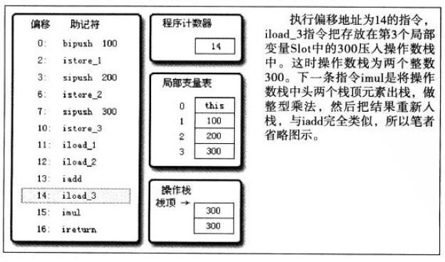

#### 执行偏移地址为16的指令
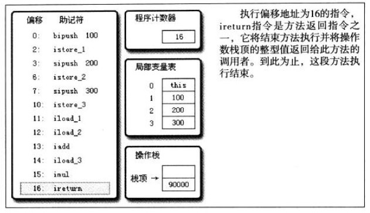

## 案例2
有一个java类：SimpleClass.class，代码如下：

```java
package org.jvminternals;
public class SimpleClass {
    public void sayHello() {
        System.out.println("Hello");
    }
}
```

执行下列命令：
> javap -v -p -s -sysinfo -constants classes/org/jvminternals/SimpleClass.class

输出文件：

跟任何典型的字节码一样，操作数与局部变量、操作数栈、运行时常量池的主要交互如下所示。

构造器函数包含两个指令。首先，this 变量被压栈到操作数栈，然后父类的构造器函数被调用，而这个构造器会消费 this，之后 this 被弹出操作数栈。

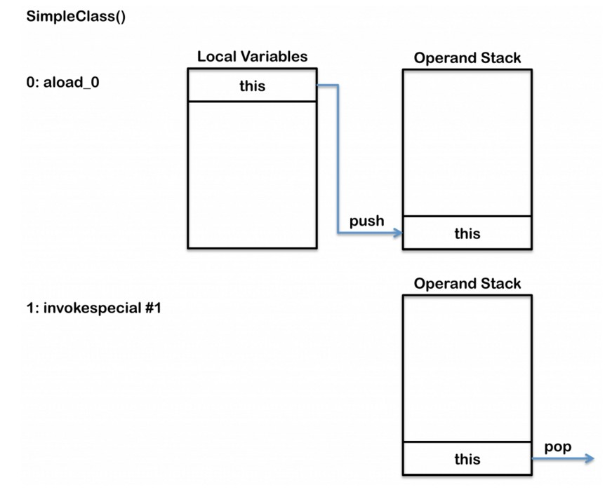

`sayHello()`方法更加复杂，正如之前解释的那样，因为它需要用运行时常量池中的指向符号引用的真实引用。第一个操作码 getstatic 从System类中将out静态变量压到操作数栈。下一个操作码 ldc 把字符串 “Hello” 压栈到操作数栈。最后 invokevirtual 操作符会调用 System.out 变量的 println 方法，从操作数栈作弹出”Hello” 变量作为 println 的一个参数，并在当前线程开辟一个新栈帧。

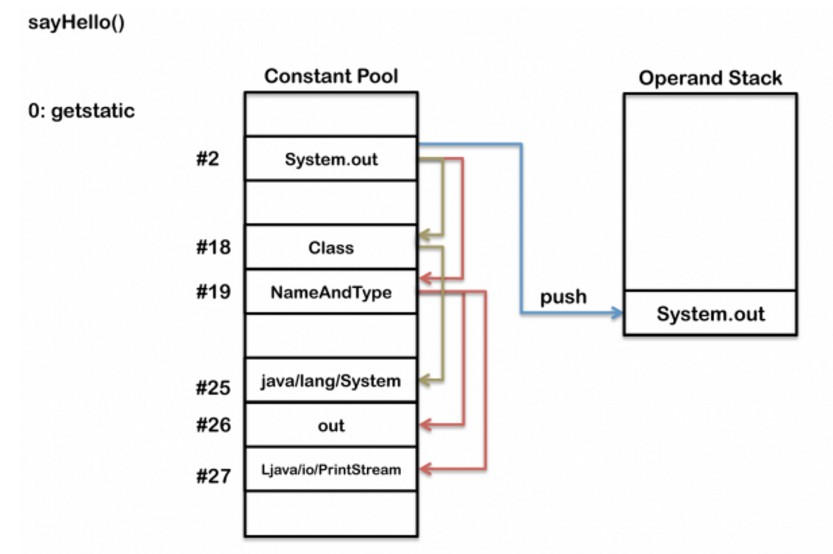
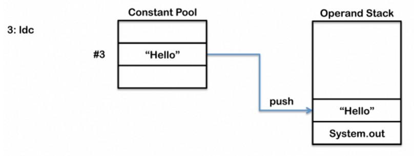
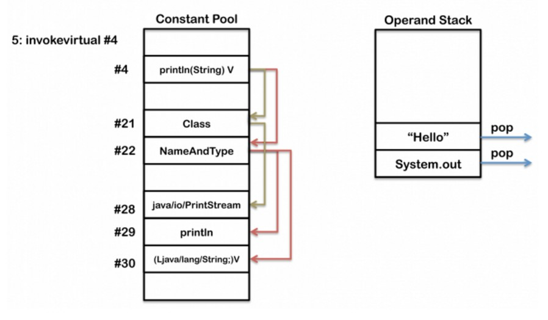


