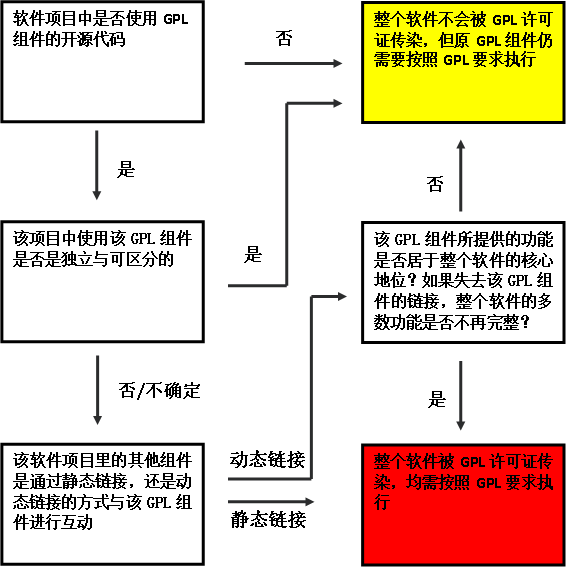
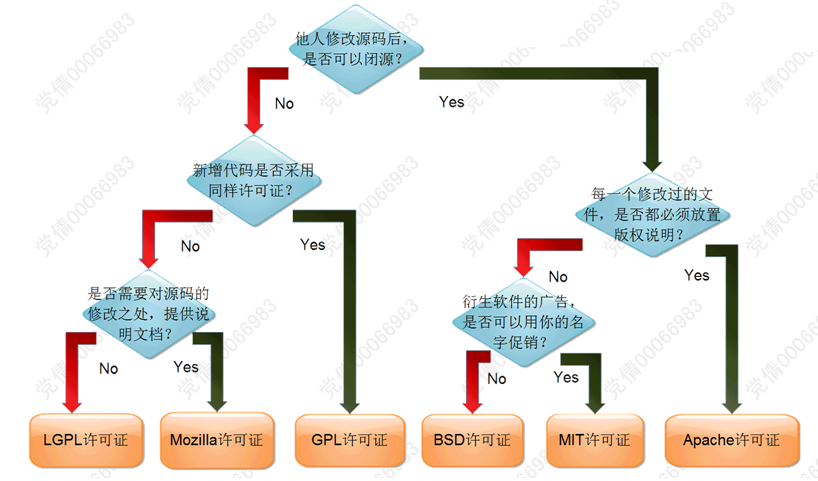

# 开源许可协议介绍

**修订记录**

| 时间 | 作者 | 内容 |
|--------|--------|--------|
| 2017.06.29 | 丁一 | 初稿 |

## 1.GPL许可协议
### 发布时间及发布组织
GPL的全称是：GNU General Public License。它是由Richard Stallman撰写。

- 1989年1月，自由软件基金会发布第一版；
- 1991年6月，自由软件基金会发布第二版；
- 2007年6月，自由软件基金会发布第三版。

目前，比较常用的是第二版、第三版。
采用这个协议的著名开源软件有：Linux、 MySQL等。

### 基本特点
#### 传染性
要求GPL-2.0许可协议下的程序的演绎作品也需要在GPL许可下发布。如果一个软件包含GPL-2.0许可协议下的部分代码，那么该软件完全发布时，整体必须适用GPL-2.0许可协议。任何一套软件，只要其中使用了GPL-2.0许可下的源程序，软件再发布时，整个软件必须在GPL-2.0许可下发布，即必须公开源代码，不允许修改后和衍生的代码作为闭源的商业软件发布和销售。

#### 担保
GPL-2.0许可协议不要求开发者提供担保，而且仅要求发布者在不担保的情况下提供不担保声明。软件发布者不提供知识产权担保就意味着该软件并非“清洁软件”,存在侵犯第三方知识产权的法律风险。

### 专利风险
在GPL-2.0许可协议下，自由软件的再发布者可以选择不申请软件专利，即使申请了软件专利也必须将其所拥有的专利免费许可给每一个人。由于GPL-2.0不要求发布者提供担保，所以对于使用者而言仍然可能面临侵犯第三方专利权的风险，而且在承担侵权责任后不能就有关损失向发布者追偿。如果出现了专利侵权纠纷，则发布者也要承担不利后果——必须完全停止发布该程序。

### 必须按照GPL-2.0许可协议提供源代码否则构成违约
无论软件以何种形式发布，都必须严格按照GPL-2.0许可协议规定的方式提供完整的源代码。以目标码或者可执行程序复制、发布程序时，也必须严格按GPL-2.0许可协议规定的方式提供完整的源代码，确保程序自始至终都以源代码形式发布。如果未能遵守有关规定，则GPL-2.0的许可自动终止，有关复制、修改和再发布等行为就将构成版权侵权。

### GPL v1.0

1. 如果发布了可执行代码，必须同时发布源代码；
1. 发布基于GPL许可证的软件，不能添加任何限制性条款；

### GPL v2.0
增加“自由还是死亡（Liberty or Death）”条款

### GPL v3.0

1. 解决软件专利问题；
1. 与其他授权条款的相容性（反破解）；
1. 原始代码的分割和组成的定义
1. 数字版权管理问题

### copyright VS copyleft
在gpl的版权声明中，经常看到的是copyleft，而不是我们熟悉的copyright。那copyleft和copyright有何区别呢？

>Copyleft是一种在现有著作权体制下的授权方式，它要求使用者必须要以同等的授权方式回馈社群。 有人将其译为“著佐权”，以彰显Copyleft是补足著作权［Copyright，版权］不足的意义。
>
> Copyleft是将一个程序成为自由软件的通用方法，同时也使得这个程序的修改和扩充版本成为自由软件。提出并使用Copyleft观念的是GNU计划，具体的发布条款包含在GNU通用公共许可证、GNU宽通用公共许可证和GNU自由文档许可证里。 
>
>“版权”［Copyright］的概念是为了限制他人任意使用创作物的自由。Copyleft则是为了保护这种自由而定义的概念：它允许他人任意的修改散布作品，惟其散布及修改的行为和作法，亦限定以Copyleft的方式行之。 Copyleft作品是有版权的；但它们加入了法律上的分发条款，保障任何人都拥有对该作品及其衍生品的使用、修改和重新发布的权力，惟前提是这些发布条款不能被改变。

总结：
Copyright： 商业软件，保留所有权利。
Copyleft： 开源软件，自由和免费。

### 关于GPL传染性
对于GPL许可证传染性适用的范围，许可证原文中并没有详细解释，根据业界分析研究，有以下三个判断步骤：
（1）该软件项目中是否使用 GPL组件的开源代码？若是，该项目中使用该GPL组件是否是独立与可区分的？
（2）该软件项目里的其他组件是通过静态链接，还是动态链接的方式与该GPL组件进行互动？
（3）如果采用动态链接的互动方式，则该GPL组件所提供的功能是否居于整个软件项目的核心地位？如果失去该GPL组件的链接，整个软件项目的多数功能是否不再完整？

如果该软件项目中没有使用GPL组件的开源代码，或者使用的GPL组件是独立与可区分的，则该软件不会被GPL许可证传染。

如果使用的GPL组件不是独立与可区分的，该软件项目里的其他组件是通过动态链接与其互动的，该GPL组件所提供的功能并非居于整个软件项目的核心地位，如果失去该GPL组件的链接，整个软件项目的多数功能仍然完整，则该软件不会被GPL许可证传染。

如果使用的GPL组件不是独立与可区分的，该软件项目里的其他组件是通过动态链接与其互动的，该GPL组件所提供的功能居于整个软件项目的核心地位，如果失去该GPL组件的链接，整个软件项目的多数功能将不再完整，则整个软件将被GPL许可证传染。

如果使用的GPL组件不是独立与可区分的，该软件项目里的其他组件是通过静态链接与其互动的，则整个软件将被GPL许可证传染。

判断流程和结果如下图所示：

关于传染性一定不能心存侥幸，不要寄期望于某些技术上的技巧，因为这里的最终判定权在 法！官！ 手上。如果组件的分离性连你自己都说服不了，那么到法官那也讨不了好。

### GPL兼容
所谓GPL兼容，也就是GPL软件中可以使用的库，这些许可证必须比GPL弱(如LGPL，BSD)，而不能是某个商业许可证。只要软件使用了GPL的代码，就必须以GPL开放源代码，并且整个项目中也不能有任何和GPL不兼容的库。

对GPL而言，与CPL、MPL、EPL、CDDL许可证均不兼容。即无法将GPL下的源代码与CPL、MPL、EPL或CDDL下源代码合并到一个程序。

### GPL提供源代码方式
#### 方式1：在物理产品中直接提供目标码/可执行形式+源代码
发布目标码时，在通常用作软件交换的物理媒介上（例如光盘），将源代码一起发布

#### 方式2：物理产品中直接提供目标码/可执行形式+源代码的书面报价
在发布目标码或可执行程序的媒介中，附上有效期至少三年且与提供产品的备件或客户服务时间等长的对应源代码的书面报价。源代码可以在通常用作软件交换的物理媒介上以价格不高于发布源代码所花费的合理价格提供；也可通过网络服务免费提供对应源代码的访问。允许用户联系服务提供商获得源代码。

#### 方式3：直接提供目标码/可执行形式+源代码的书面报价信息
发布目标代码时，附上前程序的要约的信息。这种情况主要是指发布人本身是非商业目的发布，且其所发布的程序中已经包含有其他带有要约信息的前程序（该前程序也是以目标代码或可执行程序发布的）

#### 方式4：就制定位置提供访问的方式提供目标码/可执行形式+源代码
提供源代码时，要以相同的方式在相同的地点以不加价的方式提供。目标码和源代码可以不再一个网络服务器上，只有确保获取路径可用即可。

#### 方式5：点对点方式提供目标码/可执行形式+告知目标代码和源代码获取途径
以点对点方式发布目标代码，并告知目标代码和源代码以方式四提供。

**注意**：GPL2.0只支持方式1,2,3。GPL3.0支持全部五种。

### GPL专利
GPLV2对专利规定比较模糊，指出一旦发布了含有专利的GPL代码，则意味着所有能看到该gpl代码的用户都自动获得授权（也即是无需从权利人那再申请特定的专利授权）。

GPLV3明确给出了专利相关的说明。
如果你持有一份软件专利，并且你将专利作为gpl代码发布了，那么你就自动将专利许可给了获得该gpl代码的所有人，不能再对下游的任何用户提起专利方面的限制或者诉讼。
如果你实现的代码中有不属于你的专利（或者有约束只给你授权的专利），那么你不能将这部分代码以gpl方式发布。
另外，如果你在 2007 年 3 月 28 日后签署的专利授权条款中，有约束GPL权利的内容（例如只对特定的发布者提供专利授权），那么你就不能发布涉及这些专利的GPL协议软件。k
例如如果我是技术公司A，有许多专利已经植入了GPL协议的软件中。我和软件销售公司B签署专利授权协议，规定只有从B获得的这些GPL软件才能自动获得专利授权。这个作法是违背GPLV3协议的，按GPLV3协议A此时就不能发布这类GPL软件。

总的来说，一旦你将自己的专利代码用GPL协议发布，你就丧失了获得许可收益的可能性了。当然，你如果发现某些开源软件（包括GPL协议的软件）使用了你未授权给他人的专利，那么你还是可以正常的向软件使用方提起诉讼的。必须注意到，这也意味着，你使用GPL软件也就具有潜在的侵犯他人专利的可能性（如果该GPL软件中含有第三方所有的专利）。

## 2.LGPL许可协议
最初是Library GPL的缩写，后来改称作Lesser GPL。由于GPL太严格，限制了很多商用软件使用GPL组件才推出了这个LGPL。LGPL允许商业软件通过引用类库的方式使用LGPL组件（不直接使用源代码），这样可以不需要开源商业软件的代码。但是如果要修改原始组件的代码，则涉及修改部分的代码和基于原来代码衍生的代码都必须采用LGPL协议开源。

采用这个协议的开源软件有： JBoss（LGPL 2.1）、  Hibernate（LGPL 2.1）。

### 目前常用版本
LGPL一共有三个版本：LGPL2.0,LGPL2.1和LGPL3.0。
目前的常用版本是：LGPL2.1和LGPL3.0。

### 许可协议基本特点

1．LGPL LGPLv2 协议规定，将程序“直接”翻译为另一种LGPL 程序或例程库的编程语言是对该许可程序进行修改，属于创建新的修改版本。
2．如果被许可的作品是软件库用于与使用这些功能和数据的应用程序相链接以形成可执行文件，则仅在修改后的版本也为库的情况下，才可分发该修改版本，并且许可证条款继续适用于该库。
3．修改后的例程库版本无需与库函数无关的非参数全局数据便可实现库功能。这表示在修改库时，不得将密钥、令牌、表格或其他非函数性限定数据作为调用和接收库中程序服务的必要条件。
4．如果您创建的程序通过共享库机制链接到某个根据LGPLv2.1 单独分发的作品，则可根据您选择的许可证条款分发该作品，而且无需发布LGPL作品的源码。如果您将该库与您的程序一起分发，或者在另一情况下将该作品单独分发或作为另一产品分发，则必须按照LGPLv2.1 或GPLv2+条款（可自行选择）分发对应源码。
5．如果您选择将自己的程序与一个LGPL 作品静态链接或组合，仍可自行选择许可证，但必须满足LGPL 许可证中有关用户修改、反向工程和调试的限制条款，并且LGPL 组件本身仍受LGPL 条款约束。您必须表示愿意提供或直接提供LGPL 组件的完整对应源码。您所提供的源码必须足以让用户利用修改版LGPL 组件重新生成组合作品。

### LGPL传染性
LGPL许可证具有传染性，但其传染性弱于GPL许可协议。
LGPL与GUN的系列GPL许可协议所秉持的基本理念和原则是一致的，但是有两点不同：

1. 适用范围不同：LGPL仅仅适用于特殊的领域，即LGPL仅适用于特殊设计的函数库。
2. LGPL许可协议关于传染性的规定略弱于GUN GPL许可协议，故而被称为“较宽松的公共许可证”。例如，对于GUN GPL许可协议而言，无论GPL所覆盖的程序与其他模块之间是通过静态还是动态链接的方式相互链接，只要该程序是基于GPL覆盖的程序运行的，所有发布的程序整体都必须适用GPL许可证；而LGPL许可协议则对静态链接和动态链接进行了区分，对于动态链接到已经存在于用户计算机上LGPL函数库就不需要对其他组件适用LGPL许可证。也正是因此，LGPL许可协议允许开发者自愿选择要求更为严格的GUN GPL许可协议，但已经选择了更为严格的GUN GPL许可协议的开发者则不能选择更为宽松的LGPL许可协议。

## 3.AGPL
全称是GNU AFFERO GENERAL PUBLIC LICENSE，GPL的约束生效的前提是“发布”软件，即使用了GPL协议的软件通过互联网或光盘分发软件，就必需明示地附上源代码，并且源代码和产品也受GPL保护。这样如果不“发布”就可以不受约束了。比如使用GPL组件编写一个Web系统，不发布这个系统，但是用这个系统在线提供服务，同时不开源系统代码。AGPL就是为了限制这样这样使用方式而诞生的。

概括地说，AGPL = GPL + 一条限制。这条限制就是：如果使用AGPL许可的软件与用户通过网络进行交互，也需要提供源代码给用户，所有的修改也要给用户。这个限制比GPL还要更强一些。

采用AGPL协议的著名软件有MongoDB。注意，从MongoDB的代码库中可以看到有两个协议，除了AGPL协议之外还有一个Apache License Version 2.0协议，仔细说明文件中可以发现src/mongo下面的代码都是AGPL协议的。所以大家在使用开源代码的时候要看清楚了。

## 4.BSD许可协议
全称 Berkeley Software Distribution。使用者自由的使用、修改源代码，也可以将修改后的代码作为开源或者专有软件再发布。使用了BSD协议的代码，或者以BSD协议代码为基础做二次开发自己的产品时，需要满足三个条件：

1. 如果再发布的产品中包含源代码，则在源代码中必须带有原来代码中的BSD协议。
2. 如果再发布的只是二进制类库/软件，则需要在类库/软件的文档和版权声明中包含原来代码中的BSD协议。
3. 不可以用开源代码的作者/机构名字和原来产品的名字做市场推广。

采用BSD协议的开源软件有：Nginx、Redis等。

### 发布时间及发布组织
BSD许可协议有多个变种，统称为BSD风格的许可协议。
最初的BSD许可协议在20世纪80年代末随操作系统BSD的Net/1版推出，现在被称为原版BSD许可协议、旧版BSD许可协议或4条BSD许可协议。
1999年，加利福尼大学伯克利分校将原版BSD许可协议中的广告条款删除，从而产生了新版BSD许可协议，又被称为修改版BSD许可协议、新的简化的BSD许可协议、3条款BSD许可协议等。3条款BSD许可协议、2条款BSD许可协议是经过OSI认证的。

### 许可协议基本特点
#### 再发布软件时，可不提供源代码
可仅仅以二进制形式发布软件，不要求提供源代码。

#### 无传染性
BSD许可协议对已修改代码的许可方式没有任何要求，可以任意地修改或扩展源代码得到一个演绎作品，然后以二进制形式发布，同时不需要公开这些修改或扩展，即可以把BSD许可的代码作为商业软件再发布。这使得很多企业选用开源产品时首选BSD协议，因为企业可以很方便地重用BSD许可的代码，在必要的时候修改或二次开发。

#### 禁止用版权所有人和贡献者的名字进行市场推广
未经允许，不能使用版权所有人和贡献者的名字进行市场推广。

#### 未明示专利许可
BSD许可协议没有对专利授权作出明示。在使用BSD许可协议下的程序时，版权所有人和贡献者可以要求程序使用人就程序相关的专利交专利许可费。

## 5.Apache许可协议
这个协议除了为用户提供版权许可之外，还有专利许可。与BSD协议权限类似， 允许代码修改，再发布，适用商业软件。但是也需要满足以下条件：

1. 需要给代码的用户一份Apache License。
2. 如果你修改了代码，需要在被修改的文件中说明。
3. 在延伸的代码中（修改和有源代码衍生的代码中）需要带有原来代码中的协议，商标，专利声明和其他原来作者规定需要包含的说明。
4. 如果再发布的产品中包含一个Notice文件，则在Notice文件中需要带有Apache License。你可以在Notice中增加自己的许可，但不可以表现为对Apache License构成更改。

使用Apache协议的开源软件非常广泛，有：Hadoop 、Apache 开源社区的绝大部分软件、Spring Framework等诸多重量级的开源项目。

### 目前常用版本
Apache许可协议共有三个版本:Apache1.0版、Apach1.1版和Apache2.0版。
目前使用的Apache2.0 版本是由Apahe基金会于2004年发布的版本，

### 许可协议基本特点
#### 不需要公开源代码
可以以源代码形式或目标代码形式在任何介质上再发布软件，不需要公开源代码。

#### 无传染性
Apache对于修改后代码的许可方式并无任何要求，用户可以在Apache代码上进行私人、内部及商业等多种用途的开发，也可以对自己修改后的代码选择非Apache许可协议。

#### 明确的专利许可和惩罚性条款
Apache许可协议允许贡献者申请软件专利，但同时明确规定程序内包含的、贡献者有权进行许可的专利必须许可给每一位用户，前提是该用户不能对其他用户提起与程序相关的专利诉讼。根据Apache许可协议的“专利诉讼报复条款”，一旦被许可人提起有关专利诉讼，则已经给予被许可人的专利许可将“自动”失效。

#### 限制性的商标使用权
只有在描述程序的原作者或者复制声明通知的时候才可以使用许可证颁发者的商标，否则其他情况下的使用需获得许可证颁发者的额外授权。

#### 与美国版权法对应度较高，有效减少侵权风险
Apache协议中关于用户在版权方面的权利与美国版权法第106条对应度较高，对于用户明确的授权有助于减少在版权方面的侵权风险。

## 6.MIT许可协议
源自麻省理工学院（Massachusetts Institute of Technology, MIT），又称X11协议。MIT与BSD类似，但是比BSD协议更加宽松，是目前最少限制的协议。

核心条款是：该软件及其相关文档对所有人免费，可以任意处置，包括使用，复制，修改，合并，发表，分发，再授权，或者销售。唯一的限制是，软件中必须包含上述版权和许可提示。

使用MIT的软件项目有：jQuery、Node.js。

### 许可协议基本特点
MIT许可协议的特点可以总结为以下几点：
### 再发布软件时，可不提供源代码
可仅仅以二进制形式发布软件，不要求提供源代码。

### 无传染性
MIT许可协议对已修改代码的许可方式没有任何要求，可以将修改后的源代码作为开源或者商业软件再发布。MIT许可协议商业性非常友好。

### 未明示专利许可
MIT许可协议没有对专利授权作出明示。在使用MIT许可协议下的程序时，版权所有人和贡献者可以要求程序使用人就程序相关的专利交专利许可费。

### 给以被许可人充分的自由
MIT许可协议给以被许可人充分的自由，对于再发布只有一条规定：在软件的实质部分和所有副本中包含以上版权声明和本许可声明。MIT许可协议相当于只给著作权人保留了署名权，是非常宽松的许可协议。

## 7.开源许可证风险级别

| 风险级别 | 开源许可证 | 影响 |
|---|--|--|
| 高风险  | GPLv2、GPLv3、AGPL、LGPL2.1、LGPL3.0。  | 违反许可证诉讼多，且除对许可证下源代码修改后的衍生代码需遵循该许可证外，与衍生代码合并成一个程序的私有代码，也需遵循该许可证开源。 |
| 中风险  | EPL、MPL、CPL、CDDL、APSL等  | 对许可证下源代码修改后的衍生代码需遵循该许可证开源。 |
| 低风险  | BSD、Apache 2.0、MIT、Zlib等  | 对许可证下源代码修改后的衍生代码，可不在开源，并可用于商业软件中。 |

## 8.如何选择开源许可证
一张图看懂如何选择许可证

根据风险高低，选择功能相同但许可证不同的开源代码模块时：

- 首先选择对商业软件没有影响的许可证下的开源代码，如 BSD、Apache、MIT和Zlib许可证
- 其次选择对商业软件相对友好的许可证下的开源代码，如MPL、EPL、CPL许可证
- 最后，再选择GPL、LGPL下的开源代码

