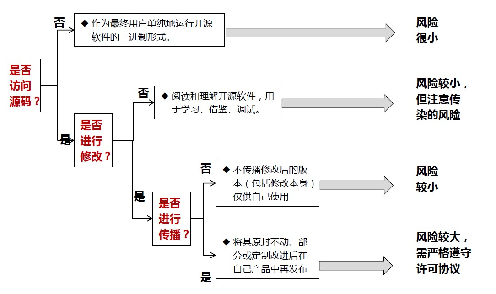
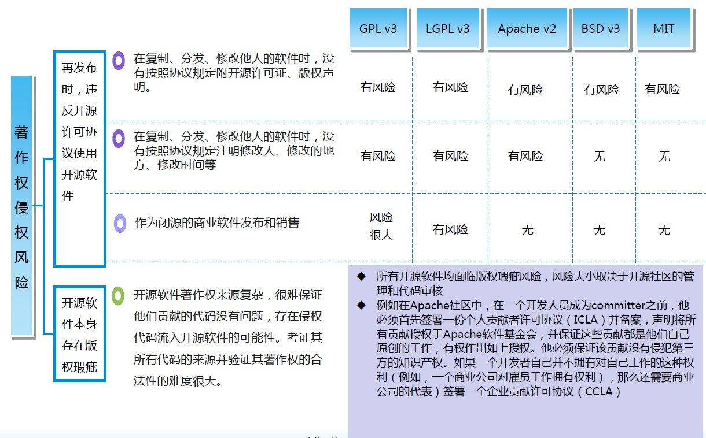
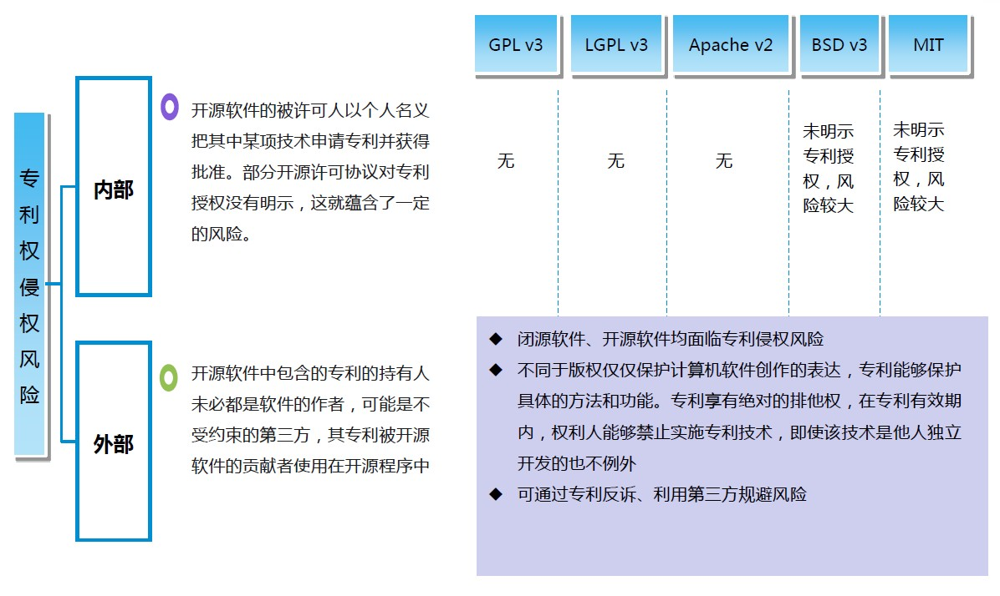
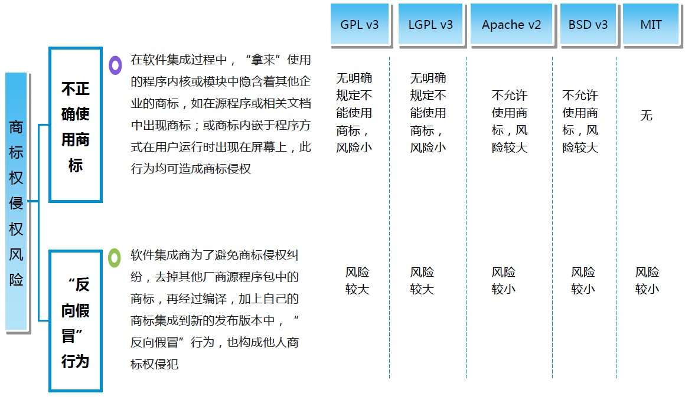

**修订记录**

| 时间 | 作者 | 内容 |
|--------|--------|--------|
| 2017.06.29 | 丁一 | 初稿 |

## 开源软件不同使用方式的风险


## 开源许可协议使用知识产权风险 -- 著作权


## 开源许可协议使用知识产权风险 -- 专利权


## 开源许可协议使用知识产权风险 -- 商标权



## GPL许可治理
能不用GPL开源软件，还是尽量别用了，受限制比较多。
如果真的需要用，需要遵循下面的处理方式。

### 如果衍生产品想继续开源
由于GPL协议的传染性，一旦在产品中使用了GPL开源组件，且不能与产品隔离，则自身产品也必须要遵循GPL协议。
需要在代码头部加上版权声明和无担保声明。
样例如下：

```
Copyright <year> ZTE Corporation.

This program is free software; you can redistribute it and/or modify 
it under the term of the GNU General Public License as published by
the Free Software Foundation; either version 2 of the license, or(at
your option) any later version.

This program is distributed in the hope that it will be useful, but 
WITHOUT ANY WARRANTY;without even the implied warranty of MERCHANTABILITY
of FITNESS FOR A PARTICULAR PURPOSE. See the GNU General Public License
for more details.
```

还需要在工程根目录下放置

1.GPL/AGPL/LGPL的协议原文。一般以LICENSE文件命名。参考附件。
2.NOTICE文件，需要包括版权、书面报价、依赖组件等信息。 参考附件：NOTICE-GPL

```
<project-name>
Copyright <year> ZTE Corporation.

This product includes software developed at ZTE Corporation.

<以下是依赖包说明>
This distribution has a binary dependency on <dependecy-package-name>, which is available under the <xxx>
License. The source code of <dependecy-package-name> can be found at <source_location>.
----------------
<其他依赖包说明>
```

### 如果衍生产品以二进制形式发布
可以随产品发布一份文档，包括以下内容。

- 提供开源声明
- 公开源代码, 以“书目报价”的方式提供。

#### 提供开源声明
开源声明需要包括：
1、关于GPL许可证的声明，表明该软件是根据GPL许可证发布；
2、全部GPL开源代码信息，表明该软件使用的全部GPL开源代码名称，以及对应许可证版本；
3、版权声明，表明该软件使用的全部GPL开源代码对应的开发者；
4、无担保声明，表明对于发布的开源软件不承担任何担保；
5、对应版本GPL许可证原文。

#### 公开源代码的方式
可以采取如下三种方式之一：
1、在开源声明中提供一份书面报价，表示我司愿意提供GPL开源代码，以及他人获取的途径及方式（如提供我司项目开源管理邮箱，并保证该邮箱处于有效管理状态），该书面报价的有效期至少3年。报价不能明显高于发行介质的费用。
2、通过互联网将全部GPL开源代码提供用户下载复制。
3、通过物理介质（如光盘等）将全部GPL开源代码，与我司产品或软件一起提供给用户。

#### 公开源代码的注意事项
##### 公开的源代码能够构建出一致版本的可执行程序
凡是使用的GPL开源代码都要公开，包括源代码、构建脚本、生成文件、配置文件和其它必要素材，这些必要素材需要可以将源代码构建为与我司提供的可执行程序完全一致的版本，也可以用于修改源代码并构建修改版本。

##### 添加修改说明
在公开源代码时，如果对开源代码进行了修改，还需要添加修改说明，标明修改内容、修改日期以及修改人（我司）等基本信息。
如果经过修改的程序在执行时是以交互方式读取命令，必须在交互界面显示所有的上述关于GPL许可证的声明、全部GPL开源代码信息、版权声明、无担保声明、对应版本GPL许可证原文或链接等。

##### 公开的源代码必须包括受到GPL许可证传染性影响的部分
如果我司基于GPL开源代码自己开发的程序与GPL开源代码“组合为一个作品”，则根据GPL许可证的传染性，我司自己开发的程序也需要一起公开源代码。

#### 开源声明模板

可以参考附件：\attachment\OPEN SOURCE SOFTWARE NOTICE.docx

## 非GPL许可治理
常用的非GPL许可协议包括：BSD、Apache、MIT。这几种许可协议宽松很多，不要求衍生作品必须开放源代码，但也需要提供版本声明和无担保声明。

### 如果衍生产品想继续开源
首先要选择一种开源许可协议，然后在源代码头部加上对应的声明。

#### Apache2.0许可协议

```
/**
 * Copyright <year> ZTE Corporation.
 *
 * Licensed under the Apache License, Version 2.0 (the "License");
 * you may not use this file except in compliance with the License.
 * You may obtain a copy of the License at
 *
 *     http://www.apache.org/licenses/LICENSE-2.0
 *
 * Unless required by applicable law or agreed to in writing, software
 * distributed under the License is distributed on an "AS IS" BASIS,
 * WITHOUT WARRANTIES OR CONDITIONS OF ANY KIND, either express or implied.
 * See the License for the specific language governing permissions and
 * limitations under the License.
 */
```

#### MIT许可协议

```
Copyright <YEAR> ZTE Corporation.

Permission is hereby granted, free of charge, to any person obtaining
a copy of this software and associated documentation files (the
"Software"), to deal in the Software without restriction, including
without limitation the rights to use, copy, modify, merge, publish,
distribute, sublicense, and/or sell copies of the Software, and to
permit persons to whom the Software is furnished to do so, subject to
the following conditions:

The above copyright notice and this permission notice shall be
included in all copies or substantial portions of the Software.

THE SOFTWARE IS PROVIDED "AS IS", WITHOUT WARRANTY OF ANY KIND,
EXPRESS OR IMPLIED, INCLUDING BUT NOT LIMITED TO THE WARRANTIES OF
MERCHANTABILITY, FITNESS FOR A PARTICULAR PURPOSE AND
NONINFRINGEMENT. IN NO EVENT SHALL THE AUTHORS OR COPYRIGHT HOLDERS BE
LIABLE FOR ANY CLAIM, DAMAGES OR OTHER LIABILITY, WHETHER IN AN ACTION
OF CONTRACT, TORT OR OTHERWISE, ARISING FROM, OUT OF OR IN CONNECTION
WITH THE SOFTWARE OR THE USE OR OTHER DEALINGS IN THE SOFTWARE.
```

#### BSD许可协议

```
Copyright <YEAR> ZTE Corporation.

Redistribution and use in source and binary forms, with or without modification, are permitted provided that the following conditions are met:

1. Redistributions of source code must retain the above copyright notice, this list of conditions and the following disclaimer.

2. Redistributions in binary form must reproduce the above copyright notice, this list of conditions and the following disclaimer in the documentation and/or other materials provided with the distribution.

THIS SOFTWARE IS PROVIDED BY THE COPYRIGHT HOLDERS AND CONTRIBUTORS "AS IS" AND ANY EXPRESS OR IMPLIED WARRANTIES, INCLUDING, BUT NOT LIMITED TO, THE IMPLIED WARRANTIES OF MERCHANTABILITY AND FITNESS FOR A PARTICULAR PURPOSE ARE DISCLAIMED. IN NO EVENT SHALL THE COPYRIGHT HOLDER OR CONTRIBUTORS BE LIABLE FOR ANY DIRECT, INDIRECT, INCIDENTAL, SPECIAL, EXEMPLARY, OR CONSEQUENTIAL DAMAGES (INCLUDING, BUT NOT LIMITED TO, PROCUREMENT OF SUBSTITUTE GOODS OR SERVICES; LOSS OF USE, DATA, OR PROFITS; OR BUSINESS INTERRUPTION) HOWEVER CAUSED AND ON ANY THEORY OF LIABILITY, WHETHER IN CONTRACT, STRICT LIABILITY, OR TORT (INCLUDING NEGLIGENCE OR OTHERWISE) ARISING IN ANY WAY OUT OF THE USE OF THIS SOFTWARE, EVEN IF ADVISED OF THE POSSIBILITY OF SUCH DAMAGE.
```

还需要在工程根目录下放置

1.协议原文。一般以LICENSE文件命名。参考附件。
2.NOTICE文件，需要包括版权。 参考附件。参考附件：NOTICE-Non GPL

### 如果衍生产品以二进制形式发布
可以随产品发布一份文档，包括以下内容。

1. 版权声明和无担保声明。
1. 依赖的第三方开源组件清单，包括组件名称、协议名称、版权等
1. 许可协议原文

如果使用了多种开源组件，自身发布产品可以不指定许可类型，但要把使用的开源组件都列出来，以及协议原文。

## 案例
### 案例1
Q: 关于AGPL协议的软件使用许可方面的问题，请教下,还望抽时间答复下，多谢!
当前我们研发的ICTPaaS系统中，提供了mongodb数据库服务，mongodb是一个开源数据库软件，服务端是AGPL开源协议，其数据库驱动是Apache开源协议。
问题1、ICTPaaS中集成AGPL协议的mongoDB服务端程序，跑在单独的进程中（docker容器中，进程是隔离的），是否违反AGPL协议？
问题2、ICTPaaS中部署的OES应用程序通过Apache协议的驱动访问ICTPaaS中提供的mongodb数据库服务，这种情况是否违反AGPL协议？

A:
关于问题1：

使用AGPL-3.0的开源数据库，其数据驱动可以是Apache-2.0的许可协议，因为Apache-2.0是AGPL-3.0兼容的。单独发布这个数据驱动时，可以以Apache-2.0进行再许可。但是如果mongodb数据库和数据驱动作为一个大软件进行发布时，软件整体必须是以AGPL-3.0许可协议下发布，即数据驱动也被传染，需要公布源代码。

关于问题2：

以下的解答用来判断AGPL许可协议的“传染性”，供参考：
（1）mongodb数据库的源代码需要公开

使用mongodb数据库向用户提供计算机远程交互服务，属于AGPL规定的附加激发条件：“尽管有本许可协议的任何其他规定，如果您修改了程序，您的修改版本必须显著地向所有的通过计算机服务器远程与之交互的用户（如果您的修改版本支持这种交互的话）提供一个获得您的版本的对应的源代码的机会，即通过一些方便用户复制软件的标准或常用方法在网络服务器上免费提供对应源码。”因此，需要按照AGPL许可协议将mongodb数据库的源代码进行公开，如果您修改了mongodb数据库，则需要公开修改版本的源代码。

（2）mongodb数据库的数据驱动和mongodb数据库作为一个软件提供时，需要公开数据驱动的源代码。

单独发布这个数据驱动时，可以以Apache-2.0进行再许可。但是如果mongodb数据库和数据驱动作为一个大软件进行发布时，软件整体必须是以AGPL-3.0许可协议下发布，即数据驱动也被传染，需要公布源代码。

（3）判断OES应用程序是否被传染？

OES应用程序和mongdb数据库部署在ICTPaaS系统中，如果ICTPaaS系统作为一个软件整体向某个用户提供计算机远程服务的话，这意味着两者组合为一个更大的程序，这两者的组合不是“聚合体”（聚合体的定义附后）。ICTPaaS整个系统被传染，需要向用户提供ICTPaaS整个系统的对应的源代码。

OES应用（或者ICTPaaS系统中的其他应用）不被传染需要满足以下两个条件：1）OES应用和mongdb数据库是隔离且独立的，OES应用不需要和mongdb数据库组合就能执行。2）OES应用和mongdb数据库分别单独打包发布，而不是存在一个商业系统中一起发布。如果不满足其中条件之一，则OES应用就会被mongdb数据库传染，而导致OES的源代码也需要公开。

另外一种自研软件不被传染的方式是，可以购买mongodb数据库的企业版本。

### 虚拟化中心治理方案
一、开源许可证危险等级
虚拟化中心根据开源软件是否需要开源，是否专利许可贡献给社区等许可证情况，制定出如下四级风险等级：
1、禁止使用 不允许采用的开源许可证，采用这些开源许可证的开源软件，公司或者项目禁止选择使用。目前除了开源使用，没有其他可以规避措施可以规避。 比如  GPL 2.0 GPL 2.0+ GPL 3.0 AGPL 
2、高风险 采用这些开源许可证的开源软件，面临开源风险，规避措施比较耗费人力。比如 GPL 1.0 EPL LGPL
3、低风险 存在一定风险，限制使用，比如BSD 3.0
4、允许使用 推荐使用，比如 Apache 2.0 MIT BSD 2.0 Zlib

二、扫描出GPL相关许可证协议处理原则
请首先确认含有该许可证的文件是否是项目要用到的？如果不用到，那么整个开源组件是否可以从项目源代码中删除？如果不能确认请到相关开源社区确认；
项目必须使用的开源组件请到开源社区核实许可证类型及版本号 GPL 1.0 2.0 or 2.0+ 3.0；
如果开源组件是双许可证授权，请到开源社区核实是否可以使用非GPL许可证进行商业发布；
如果第二步核实许可证为GPL 1.0 GPL 2.0，请项目优先考虑替换，如果不能替换，请编写中间接口模块，将接口模块开源，我们通过接口模块进行调用。或者考虑购买商业许可版本；GPL案列研究
如果第二步核实许可证为GPL 2.0+ GPL 3.0 AGPL，请项目必须替换；
如果第三步核实双重许可证可以选择商业友好许可证比如 Apache 2.0 BSD,MIT等则该开源组件可以使用。

 三、开源软件合规使用必须步骤：
声明
1、需要声明该软件采用了某开源软件某版本，是否做了修改等信息；
2、需保留开源软件本身的License文件、版权声明、其他所有权声明及免责声明，以及其他与许可证相关的内容。即不可随意删除开源软件原有的法律声明；
3、声明方式可以采用以下的一种或几种：
1）随软件一起散布的技术手册、产品说明中声明；
2）在软件安装过程中，与用户交互的界面中声明；
3）随软件一起散布的载体中增加“Notice”文件，在该文件中声明；
4）其他方式声明。


