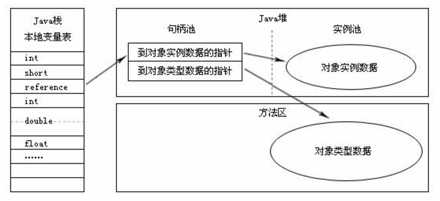
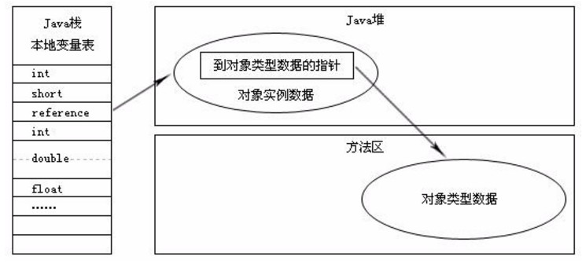

**修订记录**

| 时间 | 作者 | 内容 |
|--------|--------|--------|
| 2017.08.11 | 丁一 | 初稿 |

## 1.对象分配
### 堆上分配
#### 优先在Eden区分配
在JVM新生代堆内存一般由一块Eden区和两块Survivor区组成。在大多数情况下, 对象在新生代Eden区中分配, 当Eden区没有足够空间分配时, JVM会发起一次Minor GC, 将Eden区和其中一块Survivor区内存活的对象放入另一块Survivor区, 如果在Minor GC期间发现新生代存活对象无法放入空闲的Survivor区, 则会将对象提前放入老年代。

#### 大对象直接进入老年代
1、需要分配的大小超过eden space大小；
2、在配置了PretenureSizeThreshold的情况下，对象大小大于此值。

所谓“大对象”一般指需要大量连续内存的Java对象, 如很长的字符串或者数组。
新生代的Serial和ParNew两款收集器提供了-XX:PretenureSizeThreshold的参数, 可以让大于该值的对象直接在老年代中分配。
这样做的目的是避免在Eden区和Survivor区之间进行大量的内存复制, 从而获得足够的连续空间。

#### 长期存活的对象进入老年代
VM给每个对象定义了一个对象年龄计数器。如果对象在Eden出生并经过第一次GC后仍然存活，并能够被survivor容纳的话，将被移动到survivor区域，并且对象年龄设为1。对象在survivor每熬过一次gc，年龄就+1，当它的年龄达到一定值后（默认为15），就会被移动到老年代。可以通过-XX:MaxTenuringThreshhold设置。

VM并不会永远要求对象的年龄达到了MaxTenuringThreshhold的值才能晋升老年代。
如果survivor区中相同年龄所有对象的大小总和大于survivor空间的一半，年龄大于或者等于该年龄的对象就可以直接进入老年代。

```java
private static final int _1MB = 1024 * 1024;

/**
 * VM参数：-verbose:gc -Xms20M -Xmx20M -Xmn10M -XX:+PrintGCDetails -XX:SurvivorRatio=8 -XX:MaxTenuringThreshold=15
 * -XX:+PrintTenuringDistribution
 */
@SuppressWarnings("unused")
public static void testTenuringThreshold2() {
    byte[] allocation1, allocation2, allocation3, allocation4;
    allocation1 = new byte[_1MB / 4];   // allocation1+allocation2大于survivo空间一半
    allocation2 = new byte[_1MB / 4];  
    allocation3 = new byte[4 * _1MB];
    allocation4 = new byte[4 * _1MB];
    allocation4 = null;
    allocation4 = new byte[4 * _1MB];
}
```

#### 空间分配担保
在minor gc前，vm会先检查老年代最大可用连续空间是否大于新生代所有对象总空间，
如果条件成立，则顺利执行minor gc。
如果不满足，则查看HandlePromotionFailure设置值是否允许担保失败，如果允许，则检查老年代最大可用连续空间是否大于历次晋升到老年代对象的平均大小，如果大于，则尝试进行一次minor gc，这次gc是有风险的。如果小于或者不允许冒险，则会进行一次full gc。

```java
private static final int _1MB = 1024 * 1024;

/**
 * VM参数：-Xms20M -Xmx20M -Xmn10M -XX:+PrintGCDetails -XX:SurvivorRatio=8 -XX:-HandlePromotionFailure
 */
@SuppressWarnings("unused")
public static void testHandlePromotion() {
    byte[] allocation1, allocation2, allocation3, allocation4, allocation5, allocation6, allocation7;
    allocation1 = new byte[2 * _1MB];
    allocation2 = new byte[2 * _1MB];
    allocation3 = new byte[2 * _1MB];
    allocation1 = null;
    allocation4 = new byte[2 * _1MB];
    allocation5 = new byte[2 * _1MB];
    allocation6 = new byte[2 * _1MB];
    allocation4 = null;
    allocation5 = null;
    allocation6 = null;
    allocation7 = new byte[2 * _1MB];
}
```

### 栈上分配
to-do

### 堆外分配
直接内存并不是JVM运行时数据区的一部分, 但也会被频繁的使用: 在JDK 1.4引入的NIO提供了基于Channel与Buffer的IO方式, 它可以使用Native函数库直接分配堆外内存, 然后使用DirectByteBuffer对象作为这块内存的引用进行操作, 这样就避免了在Java堆和Native堆中来回复制数据, 因此在一些场景中可以显著提高性能. 

显然, 本机直接内存的分配不会受到Java堆大小的限制(即不会遵守-Xms、-Xmx等设置), 但既然是内存, 则肯定还是会受到本机总内存大小及处理器寻址空间的限制, 因此动态扩展时也会出现OutOfMemoryError异常.

### TLAB
堆内的对象数据是各个线程所共享的，所以当在堆内创建新的对象时，就需要进行锁操作。锁操作是比较耗时，因此JVM为每个线程在堆上分配了一块“自留地”——TLAB(全称是Thread Local Allocation Buffer)，位于堆内存的新生代，也就是Eden区。每个线程在创建新的对象时，会首先尝试在自己的TLAB里进行分配，如果成功就返回，失败了再到共享的Eden区里去申请空间。

在Java程序中很多对象都是小对象且用过即丢，它们不存在线程共享也适合被快速GC，所以对于小对象通常JVM会优先分配在TLAB上，并且TLAB上的分配由于是线程私有所以没有锁开销。因此在实践中分配多个小对象的效率通常比分配一个大对象的效率要高。

在线程自己的TLAB区域创建对象失败一般有两个原因：一是对象太大，二是自己的TLAB区剩余空间不够。通常默认的TLAB区域大小是Eden区域的1%，当然也可以手工进行调整，对应的JVM参数是-XX:TLABWasteTargetPercent。

## 2.对象晋升
### 年龄阈值
JVM为每个对象定义了一个对象年龄(Age)计数器, 对象在Eden出生如果经第一次Minor GC后仍然存活,且能被Survivor容纳的话, 将被移动到Survivor空间中, 并将年龄设为1。 以后对象在Survivor区中每熬过一次Minor GC年龄就+1. 当增加到一定程度(-XX:MaxTenuringThreshold, 默认15), 将会晋升到老年代。

### 提前晋升: 动态年龄判定
然而JVM并不总是要求对象的年龄必须达到MaxTenuringThreshold才能晋升老年代: 如果在Survivor空间中相同年龄所有对象大小的总和大于Survivor空间的一半, 年龄大于或等于该年龄的对象就可以直接进入老年代, 而无须等到晋升年龄。

## 3.对象存储结构
HotSpot VM内, 对象在内存中的存储布局可以分为三块区域：对象头、实例数据和对齐填充:

### 3.1.对象头
对象头包含两部分：类型指针和运行时数据

#### 类型指针
对象指向它的类元数据的指针: VM通过该指针确定该对象属于哪个类实例。另外, 如果对象是一个数组, 那在对象头中还必须有一块数据用于记录数组长度。

注意: 并非所有VM实现都必须在对象数据上保留类型指针, 也就是说查找对象的元数据并非一定要经过对象本身。

#### 运行时数据
运行时数据包括：HashCode、GC分代年龄、锁状态标志、线程持有的锁、偏向线程ID、偏向时间戳等, 这部分数据的长度在32位和64位的VM(暂不考虑开启压缩指针)中分别为32bit和64bit, 官方称之为“Mark Word”; 

为了用最少的空间存储更多的信息，Mark Word被设计成非固定的数据结构。它会根据对象的状态复用自己的存储空间。

比如对象处在非锁定状态，那么存储内容= 对象哈希码（25位）+ 对象的分代年龄（4位）+ 锁标志位（2位）+0（1位）。
其他状态下（轻量级锁定、重量级锁定、GC标记、可偏向），对象的存储格式如下：

| 存储内容 | 状态 | 标志位 
|--------|--------|--|
| 对象哈希码、对象分代年龄 | 未锁定 | 01 |
| 指向锁记录的指针 | 轻量级锁定 | 00 |
| 执行重量级锁定的指针 | 膨胀(重量级锁定) | 10  |
| 空(不需要记录信息) | GC标记 | 11 |
| 偏向线程ID、偏向时间戳、对象分代年龄 | 可偏向 | 01 |

### 3.2.实例数据
这部分是对象真正存储的有效信息, 也就是我们在代码里所定义的各种类型的字段内容(无论是从父类继承下来的, 还是在子类中定义的都需要记录下来)。这部分的存储顺序会受到虚拟机分配策略参数和字段在Java源码中定义顺序的影响。

HotSpot默认的分配策略为longs/doubles、ints、shorts/chars、bytes/booleans、oops(Ordinary Object Pointers),  **相同宽度的字段总是被分配到一起**, 在满足这个前提条件下, 在父类中定义的变量会出现在子类之前。如果CompactFields参数值为true(默认), 那子类中较窄的变量也可能会插入到父类变量的空隙中。

### 3.3.对齐填充
这部分并不是必然存在的, 仅起到占位符的作用, 原因是HotSpot自动内存管理系统要求对象起始地址必须是8字节的整数倍, 即对象的大小必须是8字节的整数倍。

## 4.对象创建的过程
new一个Java Object(包括数组和Class对象), 在JVM中会进行如下操作:

1.VM遇到new指令: 首先去检查该指令的参数是否能在常量池中定位到一个类的符号引用, 并检查这个符号引用代表的类是否已被加载、解析和初始化过. 如果没有, 必须先执行相应的类加载过程。

2.类加载检查通过后: VM将为新生对象分配内存(对象所需内存的大小在类加载完成后便可完全确定)。
  VM采用 **指针碰撞** 和 **空闲列表** 方式来划分内存。

| 方式 | 适用场景 | 描述 | 收集器
|-|-|-|-|
| 指针碰撞 | 内存规整  | 指针向空闲空间那边挪动一段与对象大小相等的距离 |  Serial、ParNew等有内存压缩整理功能的收集器  |
| 空闲列表 | 内存不规整 | VM维护一个列表，记录哪些内存块可用。<br>在分配的时候，选择一块足够大的空间划分给对象实例。 | CMS这种基于Mark-Sweep算法的收集器，|

3.除了考虑如何划分可用空间外, 由于在VM上创建对象的行为非常频繁, 因此需要考虑内存分配的并发问题. 解决方案有两个:

- 对分配内存空间的动作进行同步 -采用 CAS配上失败重试 方式保证更新操作的原子性;
- 把内存分配的动作按照线程划分在不同的空间之中进行 -每个线程在Java堆中预先分配一小块内存, 称为本地线程分配缓冲TLAB, 各线程首先在TLAB上分配, 只有TLAB用完, 分配新的TLAB时才需要同步锁定(使用-XX:+/-UseTLAB参数设定)。

4.接下来将分配到的内存空间初始化为零值(不包括对象头, 且如果使用TLAB这一个工作也可以提前至TLAB分配时进行). 这一步保证了对象的实例字段可以不赋初始值就直接使用(访问到这些字段的数据类型所对应的零值)。

5.然后要对对象进行必要的设置: 如该对象所属的类实例、如何能访问到类的元数据信息、对象的哈希码、对象的GC分代年龄等, 这部分息放在对象头中。根据虚拟机运行状态的不同，比如是否启用偏向锁等，对象头会有不同的设置方式。

6.上面工作都完成之后, 在虚拟机角度一个新对象已经产生, 但在Java视角对象的创建才刚刚开始(`<init>`方法尚未执行, 所有字段还都为零)。 所以new指令之后一般会(由字节码中是否跟随有invokespecial指令所决定--Interface一般不会有, 而Class一般会有)接着执行`<init>`方法, 把对象按照程序员的意愿进行初始化, 这样一个真正可用的对象才算完全产生出来。

## 5.对象的访问定位
建立对象是为了使用对象, Java程序需要通过栈上的reference来操作堆上的具体对象. 主流的有 **句柄** 和 **直接指针** 两种方式去定位和访问堆上的对象:

### 句柄
Java堆中将会划分出一块内存来作为句柄池, reference中存储对象的句柄地址, 而句柄中包含了对象实例数据与类型数据的具体各自的地址信息:



### 直接指针(HotSpot使用)
该方式Java堆对象的布局中就必须考虑如何放置访问类型数据的相关信息, reference中存储的直接就是对象地址: 



这两种对象访问方式各有优势: 使用句柄来访问的最大好处是reference中存储的是稳定句柄地址, 在对象被移动(垃圾收集时移动对象是非常普遍的行为)时只会改变句柄中的实例数据指针，而reference本身不变。而使用直接指针最大的好处就是速度更快, 它节省了一次指针定位的时间开销,由于对象访问非常频繁, 因此这类开销积小成多也是一项非常可观的执行成本。