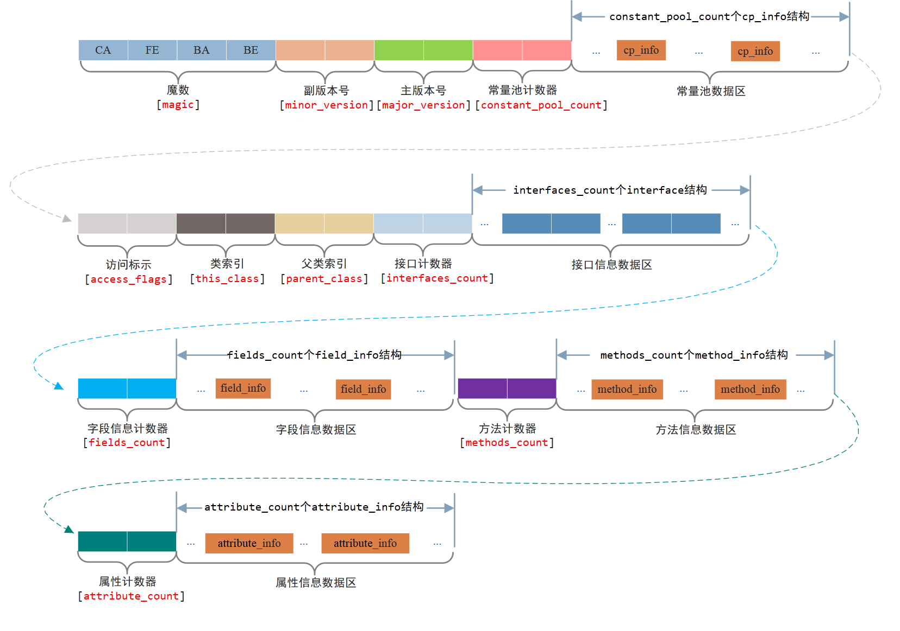
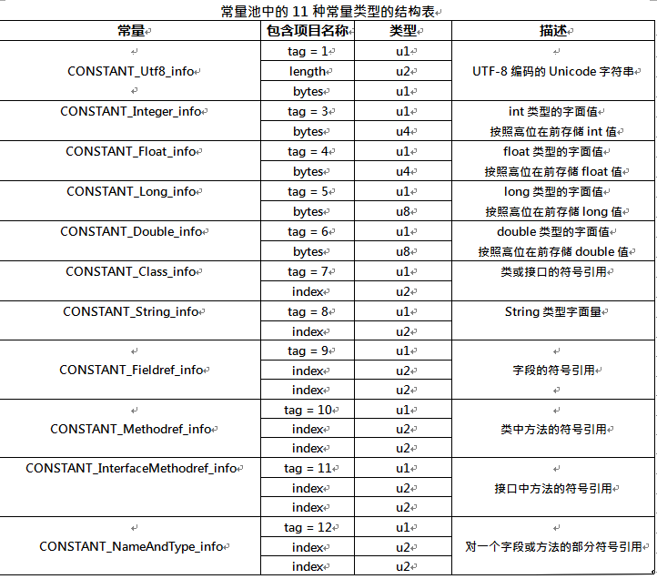
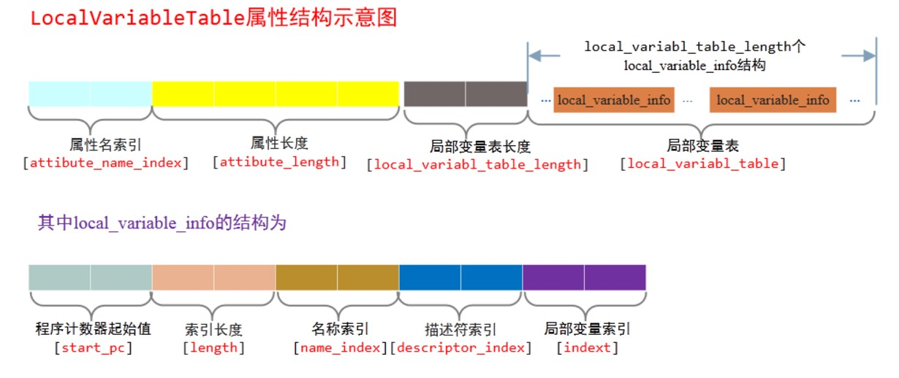

**修订记录**

| 时间 | 作者 | 内容 |
|--------|--------|--------|
| 2017.08.09 | 丁一 | 初稿 |

## Java字节码
为了实现 WORA(Write Once Run Anywhere)，JVM 使用 java 字节码，这是一种介于 Java（用户语言）和机器语言的中间语言。Java 字节码是部署 Java 代码的最小单元。它保证了平台无关性。

先看一个例子，
```java
public void addUser(String userName) {
    User user = new User(userName);
    userMap.put(userName, user);
}
```
第一行方法，编译后的字节码为

```java
com.jvm.user.UserAdmin.addUser(Ljava/lang/String;)V
```

其中，`L<classname>` 表示一个对象实例。这意味着 addUser() 方法获得一个 java/lang/String 对象作为一个参数。
“V” 代表没有返回值。

Java 字节码的指令集包含操作码和操作数。例如 invokevirtual 操作码需要两个字节的操作数。
操作码（比如 aload_0,getfield 和 invokevirtual）用一个字节表示，范围0--255。

## class类文件的结构
class文件是一组以8位字节位基础单位的二进制流，各个数据严格按照顺序紧凑排列在Class文件中，中间没有任何分隔符。它采用一种类似c语言结构体的伪结构来存储数据，这种伪结构只有两种数据类型：无符号数和表。

无符号数属于基本的数据类型，以u1、u2、u4、u8分别代表1个字节、2个字节、4个字节、8个字节的无符号数，无符号数可以用来描述数字、索引引用、数量值或utf-8编码构成的字符串值。

表是由多个无符号数或其他表作为数据项构成的复合数据类型，所有表都习惯性地以_info结尾。

每一个 Class 文件对应于一个如下所示的 ClassFile 结构体：

```java
ClassFile {
    u4 magic;
    u2 minor_version;
    u2 major_version;
    u2 constant_pool_count;
    cp_info constant_pool[constant_pool_count-1];
    u2 access_flags;
    u2 this_class;
    u2 super_class;
    u2 interfaces_count;
    u2 interfaces[interfaces_count];
    u2 fields_count;
    field_info fields[fields_count];
    u2 methods_count;
    method_info methods[methods_count];
    u2 attributes_count;
    attribute_info attributes[attributes_count];}
```



## class文件结构分析字节码
我们以TestClassCode.class为例进行分析，它的源代码如下：
```java
package com.test.doc.exp;

public class TestClassCode {

    private String    attribute_1;

    protected Integer attribute_2;

    public void testInterface_1() {

    }

    public String testInterface_2(String param) {
        return param;
    }

}
```

TestClassCode.class对应的字节码如下：

```
cafe babe 0000 0032 0018 0700 0201 001e 636f 6d2f 7465 7374 2f64 6f63 2f65 7870
2f54 6573 7443 6c61 7373 436f 6465 0700 0401 0010 6a61 7661 2f6c 616e 672f 4f62
6a65 6374 0100 0b61 7474 7269 6275 7465 5f31 0100 124c 6a61 7661 2f6c 616e 672f
5374 7269 6e67 3b01 000b 6174 7472 6962 7574 655f 3201 0013 4c6a 6176 612f 6c61
6e67 2f49 6e74 6567 6572 3b01 0006 3c69 6e69 743e 0100 0328 2956 0100 0443 6f64
650a 0003 000d 0c00 0900 0a01 000f 4c69 6e65 4e75 6d62 6572 5461 626c 6501 0012
4c6f 6361 6c56 6172 6961 626c 6554 6162 6c65 0100 0474 6869 7301 0020 4c63 6f6d
2f74 6573 742f 646f 632f 6578 702f 5465 7374 436c 6173 7343 6f64 653b 0100 0f74
6573 7449 6e74 6572 6661 6365 5f31 0100 0f74 6573 7449 6e74 6572 6661 6365 5f32
0100 2628 4c6a 6176 612f 6c61 6e67 2f53 7472 696e 673b 294c 6a61 7661 2f6c 616e
672f 5374 7269 6e67 3b01 0005 7061 7261 6d01 000a 536f 7572 6365 4669 6c65 0100
1254 6573 7443 6c61 7373 436f 6465 2e6a 6176 6100 2100 0100 0300 0000 0200 0200
0500 0600 0000 0400 0700 0800 0000 0300 0100 0900 0a00 0100 0b00 0000 2f00 0100
0100 0000 052a b700 0cb1 0000 0002 000e 0000 0006 0001 0000 0003 000f 0000 000c
0001 0000 0005 0010 0011 0000 0001 0012 000a 0001 000b 0000 002b 0000 0001 0000
0001 b100 0000 0200 0e00 0000 0600 0100 0000 0b00 0f00 0000 0c00 0100 0000 0100
1000 1100 0000 0100 1300 1400 0100 0b00 0000 3600 0100 0200 0000 022b b000 0000
0200 0e00 0000 0600 0100 0000 0e00 0f00 0000 1600 0200 0000 0200 1000 1100 0000
0000 0200 1500 0600 0100 0100 1600 0000 0200 17
```

我们来看看类文件的格式。
它是16进制，其中2个数字表示一个字节。比如cafe babe为4个字节。

### 魔术(magic)
类文件的头4个字节是魔法数字。这是一个用于区分类文件的预定义值。如你所见，这个值总是 0XCAFEBABE。简而言之，如果一个文件的前四个字节是 0XCAFEBABE，它就会被认为是 Java 类文件。

### 版本号(minor_version,major_version)
class文件对应的字节码：0000 0032，第5、6个字节是次版本号（minor_version），第7、8个字节是主版本号（major_version）。java的版本号是从45开始的，jdk1.1之后的每个jdk大版本发布主版本号向上＋1，高版本的jdk能向下兼容以前版本的class文件，但不能运行以后版本的class文件，即使文件格式发生任何变化，虚拟机也拒绝执行超过其版本号的class文件。
本例中次版本号：0x0000，主版本号：0x0032，代表编译器使用jdk1.6.0_1版本。

### 常量池计数器、数据区（constant_pool_count, constant_pool[]）
常量池是class文件中非常重要的结构，它描述着整个class文件的字面量信息，可以理解为class文件之中的资源仓库。常量池是由一组 constant_pool 结构体数组组成的，而数组的大小则由常量池计数器指定。常量池计数器 constant_pool_count 的值 =constant_pool表中的成员数 + 1。constant_pool表的索引值只有在大于 0 且小于 constant_pool_count时才会被认为是有效的。

**注意：也就是说：常量池的容量=count - 1，索引从1开始。其他的集合类型，比如接口索引集合、字段集合、方法集合等的容量、下标和一般习惯相同。**

本例中常量池容量为0x0018，代表十进制数24，常量池中有23项常量，所以范围为1-23。在class文件格式规范制定之时，设计者将第0项常量空出来是有特殊考虑的，这样做的目的在于满足后面某些常量池的索引值的数据在特定情况下需要表达“不引用任何一个常量池项目”的含义，这种情况可以把索引值置为0来表示。

接下来存储的是常量池数据区，主要存放两大类常量：字面量和符号引用。字面量比较接近java中的常量概念。而符号引用主要包括下列三类常量：

- 类和接口的全限定名称
- 字段的名称和描述符
- 方法的名称和描述符

常量池中每一个常量都是一个表，共有14中不同结构的表结构数据：

| 类型 | 标志 | 描述 |
|--|--|--|
| CONSTANT_Utf8_info | 1 | UTF-8编码的字符串 |
| CONSTANT_Integer_info | 3 | 整型字面量 |
| CONSTANT_Float_info | 4 | 浮点型字面量 |
| CONSTANT_Long_info | 5 | 长整型字面量 |
| CONSTANT_Double_info | 6 | 双精度浮点型字面量 |
| CONSTANT_Class_info | 7 | 类或接口的符号引用 |
| CONSTANT_String_info | 8 | 字符串类型字面量 |
| CONSTANT_Fielddef_info | 9 | 字段的符号引用 |
| CONSTANT_Methoddef_info | 10 | 类中方法的符号引用 |
| CONSTANT_InterfaceMethoddef_info | 11 | 接口中方法的符号引用 |
| CONSTANT_NameAndType_info | 12 | 字段或方法的部分符号引用 |
| CONSTANT_MethodHandle_info  | 15 | 表示方法句柄 |
| CONSTANT_MethodType_info | 16 | 表示方法类型 |
| CONSTANT_InvokeDynamic_info | 18 | 表示方法句柄 |

除了CONSTANT_MethodHandle_info、CONSTANT_MethodType_info和CONSTANT_InvokeDynamic_info外，其他11个常量都有各自的结构，如下图：


注意：对于CONSTANT_Utf8_info，其lenth参数为u2，也即最大为65535，也就是说Java中的类、方法名、变量名、参数名的最大长度不能超过64K。

类型标志位是第一个字节(u1)。找到类型后，再确定后续的位置。
比如，第一项常量值：0x07 0002，它的标志位是0x07，属于CONSTANT_Class_info，此类型代表一个类或接口的符号引用。0x0002，是它的符号引用(index)，指向常量池的第二项常量。

第二项常量值：0x01 001e 636f 6d2f 7465 7374 2f64 6f63 2f65 7870 2f54 6573 7443 6c61 7373 436f 6465 ，它的标志位是0x01，属于CONSTANT_Utf8_info，此类型代表一个UTF-8编码的字符串，长度为001e，即十进制数30(字节)，字符串值为0x636f 6d2f 7465 7374 2f64 6f63 2f65 7870 2f54 6573 7443 6c61 7373 436f 6465，比如0x63对应的十进制为99，转换成ascii码字符为：c，剩余转换类似。

因此最终的字符串为：com/test/doc/exp/TestClassCode 。

以此方法，我们可以依次得到剩下的常量池数据区，当然也可以使用javap -verbose TestClassCode命令，输出TestClassCode.class对应的常量池区域：

```java
Constant pool:
   #1 = Class              #2             //  com/test/doc/exp/TestClassCode
   #2 = Utf8               com/test/doc/exp/TestClassCode
   #3 = Class              #4             //  java/lang/Object
   #4 = Utf8               java/lang/Object
   #5 = Utf8               attribute_1
   #6 = Utf8               Ljava/lang/String;
   #7 = Utf8               attribute_2
   #8 = Utf8               Ljava/lang/Integer;
   #9 = Utf8               <init>
  #10 = Utf8               ()V
  #11 = Utf8               Code
  #12 = Methodref               #3.#13         //  java/lang/Object."<init>":()V
  #13 = NameAndType        #9:#10         //  "<init>":()V
  #14 = Utf8               LineNumberTable
  #15 = Utf8               LocalVariableTable
  #16 = Utf8               this
  #17 = Utf8               Lcom/test/doc/exp/TestClassCode;
  #18 = Utf8               testInterface_1
  #19 = Utf8               testInterface_2
  #20 = Utf8               (Ljava/lang/String;)Ljava/lang/String;
  #21 = Utf8               param
  #22 = Utf8               SourceFile
  #23 = Utf8               TestClassCode.java
```

在常量池中，还有一些类似LineNumberTable、LocalVariableTable、I、V、<init>等字符常量，他们不是java代码中的直接出现的。他们主要用于不方便使用固定长度表达的内容。比如field_info, method_info等。

### 访问标志(access_flags)
两字节，这个标志展示了类的修饰信息，即：public，final，abstract 或者是否是一个 interface。
具体的标志位以及标志含义见下表：

| 标志名 | 值 | 设置后的含义 | 设置者 |
|--|--|--|--|
| ACC_PUBLIC | 0x0001 | public类型 | 类和接口 |
| ACC_FINAL | 0x0010 | final类型 | 只有类 |
| ACC_SUPER | 0x0020 | 使用新型的invokespecial语义，<br>JDK1.2之后编译出来为真 | 类和接口 |
| ACC_INTERFACE | 0x0200  | 类型为接口 | 只有接口 |
| ACC_ABSTRACT | 0x0400 | 类型为抽象 | 接口和类 |
| ACC_SYNTHETIC | 0x1000 | 标识这个类并非由用户代码产生的 |  |
| ACC_ANNOTATION | 0x2000 | 标识为注解 |  |
| ACC_ENUM | 0x4000 | 标识为枚举 |  |

本例中访问标志为0x0021，它的ACC_PUBLIC(0x0001)，ACC_SUPER(0x0020)标志应当为真，而其他标志为假。

### 类索引(this_class),父类索引(super_class)
两字节，常量池中（constant_pool）的这两个索引位置分别代表 this 和 父类。

类索引确定类的全限定名称。父类索引确定父类的全限定名称。

本例中，类索引对应0x0001，即类索引指向常量池第一个变量，常量池对应为CONSTANT_Class_info的类描述符常量，再通过该变量的索引值找到定义在CONSTANT_Utf8_info类型中的全限定名字符串com/test/doc/exp/TestClassCode。父类索引为0x0003，值为java/lang/Object。

### 接口计数器(interfaces_count), 接口集合(interfaces[])
interfaces_count存储了当前类实现的接口数目。如果没有实现任何接口，该计数器为0。
接口集合存放具体的接口信息。

本例中，接口数量为0x0000，即当前不实现任何接口。

### 字段计数器((fields_count), 字段表集合(fields[])
字段表集合用于描述接口或类中声明的变量，是指由若干个字段表（field_info）组成的集合。对于在类中定义的若干个字段，经过JVM编译成class文件后，会将相应的字段信息组织到一个叫做字段表集合的结构中，字段表集合是一个类数组结构，会将类中定义的字段个数设到字段计数器中，然后每个字段信息组成一个field_info结构，依次存储到字段计数器之后。
field_info结构如下：

```java
struct field_info {
    u2 access_flags;
    u2 name_index;
    u2 descriptor_index;
    u2 attributes_count;
    attribute_info attributes;
}
```

access_flags是一个u2的数据类型，字段访问标志的取值范围如下表所示：

| 标志名称 | 标志值 | 含义 |
|--|--|--|
| ACC_PUBLIC | 0x0001 | public字段 |
| ACC_PRIVATE | 0x0002 | private字段 |
| ACC_PROTECTED | 0x0004 | protected字段 |
| ACC_STATIC | 0x0008 | static字段 |
| ACC_FINAL | 0x0010 | final字段 |
| ACC_VOLATILE |0x0040  | volatile字段 |
| ACC_TRANSIENT | 0x0080 | transient字段 |
| ACC_SYNTHETIC | 0x1000 | 由编译器自动产生的字段 |
| ACC_ENUM | 0x4000 | enum类型字段 | 

跟随access_flags标志的是两个索引值：name_index和descriptor_index。他们都是对常量池的引用，分别代表字段的简单名称以及字段和方法的描述符。

字段和方法的描述符主要作用是用来描述字段的数据类型、方法的参数列表（包括数量、类型和顺序）和返回值。基本数据类型和void类型都用一个大写字符表示。对象类型用L加对象全限定符表示。

| 标识字符 | 类型 | 描述 |
|--------|--------|--------|
| B | byte | 字节 |
| C | char | Unicode 字符 |
| D | double | 双精度浮点数 |
| F | float | 单精度浮点数 |
| I | int | 整数 |
| J | long | 长整数 |
| L全限定名称; | 引用 | 类实例 |
| S | short | 短整型 |
| V | void | 空 |
| Z | boolean | true or false |
| [ | 引用 | 一维数组 |

对于数组类型，每一维度使用一个前置“[”表示，比如java.lang.String[][]，可以表示成：[[Ljava/lang/String;,一个整形数组可以表示成：[I。

描述方法时，按照先参数列表，后返回值的顺序描述。参数列表放在()中，多个参数用;分割。
比如void inc()，描述成()V
java.lang.String toString(), 描述成()Ljava/lang/toString;
Object mymethod(int I, double d, Thread t，描述成：(IDLjava/lang/Thread;)Ljava/lang/Object; 


本例中字段表集合值对应0x0002 0002 0005 0006 0000 0004 0007 0008 0000，字段表计数器0x0002，代表当前类包含2个字段。access_flags对应0x0002，代表字段为private属性。name_index为0x0005，指向常量池第五个常量，即attribute_1。descriptor_index为0x0006，指向常量池第六个常量，即Ljava/lang/String; 。随后紧跟的0x0000代表该字段没有对应的属性。

字段表集合中不会列出从超类或父接口中继承而来的字段，但由可能列出原本java代码中不存在的字段，譬如在内部类中为了保持对外部类的访问性，会自动添加指向外部类实例的字段。

### 方法计数器(methods_count), 方法表集合(methods[])
方法表集合是指由若干个方法表（method_info）组成的集合。对于在类中定义的若干个，经过JVM编译成class文件后，会将相应的method方法信息组织到一个叫做方法表集合的结构中，字段表集合是一个类数组结构，如下：

```java
struct method {
    u2 method_counts;
    method_info[] method_infos;
}
```

方法表结构method_info如下：

```java
struct method_info {
    u2 access_flags;
    u2 name_index;
    u2 descriptor_index;
    u2 attributes_count;
    attribute_info attributes;
}
```

这个结构跟field_info结构几乎完全一致，但因为volatile关键字和transient关键字不能修饰方法，所以方法表中的访问标志没有了ACC_VOLATILE标志和ACC_TRANSIENT标志。与之相对的方法表中增加了ACC_SYNCHRONIZED、ACC_NATIVE、ACC_STRICTFP、ACC_ABSTRACT。

| 标志名称 | 标志值 | 含义 |
|--|--|--|
| ACC_PUBLIC | 0x0001 | public方法 |
| ACC_PRIVATE | 0x0002 | private方法 |
| ACC_PROTECTED | 0x0004 | protected方法 |
| ACC_STATIC | 0x0008 | static方法 |
| ACC_FINAL | 0x0010 | final方法 |
| ACC_SYNCHRONIZED |0x0020  | synchronized方法 |
| ACC_BRIDGE | 0x0040 | 编译器产生的桥接方法 |
| ACC_VARARGS |0x0080  | 可变参数类型 |
| ACC_NATIVE | 0x0100 | native方法 |
| ACC_ABSTRACT | 0x0400 | abstract方法 |
| ACC_STRICTFP | 0x0800 | strictfp方法 |
| ACC_SYNTHETIC | 0x1000 | 由编译器自动产生的字段 |

方法的名称索引、描述索引与字段类似。

方法里的代码经过编译器编译成字节码指令后，存放在方法属性表集合(Code属性)中。在Class文件，字段表，方法表中都可以携带自己的属性表集合，以用于描述某些场景专有的信息。与Class文件中其它的数据项目要求的顺序、长度和内容不同。


### 属性表计数器(attributes_count), 属性表集合(attributes[])
在字段表和方法表中，最后一个字段是attributes，可以用来来描述附加信息。jvm内部通常会内置预置一些属性。

属性表集合的限制稍微宽松一些，不再要求各个属性表具有严格的顺序，并且只要不与已有的属性名重复，任何人实现的编译器都可以向属性表中写入自己定义的属性信息，Java虚拟机运行时会忽略掉它不认识的属性。

属性表的通用结构如下：

```java
struct attribute_info {
    u2 attribute_name_index;
    u4 attribute_length;
    u1 info[attribute_length];
}
```

目前jvm常见的预定义属性包括：

| 属性名 | 位置 | 描述 |
|--------|--------|--------|
| Code | 方法表 | Java代码编译生成的字节码指令 |
| ConstanceValue | 字段表 | final关键字定义的常量 |
| Deprecated | 类、方法表、字段表 | 被声明为deprecated的方法和字段 |
| Exceptions | 方法表 | 方法抛出的异常 |
| InnerClasses | 类文件 | 内部类列表 |
| LineNumberTable | Code属性 | Java源码的行号与字节码指令的对应关系 |
| LocalVariableTable | Code属性 | 方法的局部变量描述 |
| SourceFile | 类文件 | 源文件名称 |
| Synthetic | 类、方法表、字段表 | 标识方法或者字段为编译器自动生成 |

下面详细说明下集中常见的属性。

### Code属性
Java程序方法体中的代码经过Javac编译器处理后，最终变成字节码指令集存储在code属性内。Code属性表的结果如下：

```java
Code_attribute {
    u2 attribute_name_index;
    u4 attribute_length;
    u2 max_stack;
    u2 max_locals;
    u4 code_length;
    u1 code[code_length];
    u2 exception_table_length;
    { u2 start_pc;
        u2 end_pc;
        u2 handler_pc;
        u2 catch_type;
    } exception_table[exception_table_length];
    u2 attributes_count;
    attribute_info attributes[attributes_count];
}
```

attribute_name_index是一项指向常量表的索引，常量值固定为“Code”，它代表了该属性的属性名称，
attribute_length指示了属性值的长度，由于属性名称索引与属性长度一共是6个字节，所以属性值的长度固定为整个属性表的长度减去6个字节。

max_stack代表了操作数栈(Operand Stacks)的最大深度。在方法执行的任意时刻，操作数栈都不会超过这个深度。虚拟机运行的时候需要根据这个值来分配栈帧(Frame)中的操作数栈深度。

max_locals代表了局部变量表所需的存储空间。在这里，max_locals的单位是Slot（2个字节），Slot是虚拟机为局部变量表分配内存所使用的最小单位。对于byte,char,float,int,shot,boolean,reference和returnAddress等长度不超过32位的数据类型，每个局部变量占1个Slot，而double与long这两种64位的数据类型而需要2个Slot来存放。

方法参数(包括实例方法中的隐藏参数“this”)，显示异常处理器的参数(Exception Handler Parameter,即try-catch语句中catch块所定义的异常)，方法体中定义的局部变量都需要使用局部表来存放。

另外，并不是在方法中使用了多个局部变量，就把这些局部变量所占的Slot之和作为max_locals的值，原因是局部变量表中的Slot可以重用，当代码执行超出一个局部变量的作用域时，这个局部变量所在的Slot就可以被其他局部变量所使用，编译器会根据变量的作用域来分类Slot并分配给各个变量使用，然后计算出max_locals的大小。

#### code_length和code[]
code_length表示指令总长度。它是u4长度，虽然理论上可以表示2的32次方-1个指令，但java目前规定一个方法的最大指令数不能超过65535个，相当于u2。
code是一系列字节流，每个指令用u1单位表示。因此java指令范围小于255个，目前java的指令有200多个。

在上例中：code_length和code的字节码为：0000 0005 2ab7 0001 b1。
其中0000 0005表示code长度为5，也即5条指令。
2a:  aload
b7:  invokespecial
00:  nop 什么也不做
01:  将null推送到栈顶
b1:  return

用javap解析时，
```java
         0: aload_0
         1: invokespecial #1                  // Method java/lang/Object."<init>":()V
         4: return
```
会发现把第3，4条指令忽略了。第3，4条指令是第2条指令invokespecial的参数和返回值都是空。

#### exception_table
异常表的结构如下：
```java
    u2 exception_table_length;
    { u2 start_pc;
        u2 end_pc;
        u2 handler_pc;
        u2 catch_type;
    } 
    exception_table[exception_table_length];
```
它表示在第start_pc行到end_pc行（不含）出现类型为catch_type的异常（含子类型），则跳转到第handler_pc行进行处理。
如果catch_type为0，则表示任何异常都要跳转到handler_pc行进行处理。


### Exception属性
Exception属性是列举方法中可能抛出的Checked Exception，也就是throws抛出的异常。
结构体如下：
```java
Exceptions_attribute {
    u2 attribute_name_index;
    u4 attribute_length;
    u2 number_of_exceptions;
    u2 exception_index_table[number_of_exceptions];
}
```
对于如下的代码：
```java
    public int inc() {
        int x;
        try {
            x = 1;
            return x;
        } catch (Exception e) {
            x = 2;
            return x;
        } finally {
            x = 3;
        }
    }
```

编译后的字节码为：
```java
    Code:
      stack=1, locals=5, args_size=1
         0: iconst_1
         1: istore_1
         2: iload_1
         3: istore_2
         4: iconst_3
         5: istore_1
         6: iload_2
         7: ireturn
         8: astore_2
         9: iconst_2
        10: istore_1
        11: iload_1
        12: istore_3
        13: iconst_3
        14: istore_1
        15: iload_3
        16: ireturn
        17: astore        4
        19: iconst_3
        20: istore_1
        21: aload         4
        23: athrow
      Exception table:
         from    to  target type
             0     4     8   Class java/lang/Exception
             0     4    17   any
             8    13    17   any
            17    19    17   any
```
首先执行0-3行，是try中的语句，执行完x=1,并存入本地变量表中，即istore_2。继续执行4--7行，执行finally块, 将x=1，并存在本地变量表即：istore_1，但第6条执行的是iload_2，也即把本地变量表之前保存的结果1取出放到栈顶，return。
如果执行0--3行指令过程中出现错误，则跳转执行第8条指令，即catch块中的指令。
剩下的类似。

### LineNumberTable属性
LineNumberTable属性用于描述Java源代码行号与字节码行号(字节码偏移量)之间的对应关系。它并不是运行时必须的属性。如果选择不生成LineNumberTable属性表，对程序运行产生的最主要的影响就是在抛出异常时，堆栈中将不会显示出错的行号，并且在调试程序的时候无法按照源码来设置断点。

```java
LineNumberTable_attribute {
  u2 attribute_name_index;
  u4 attribute_length;
  u2 line_number_table_length;
{ u2 start_pc;
  u2 line_number;
} line_number_table[line_number_table_length];
}
```

其中，line_number_table是一个数量为line_number_table_length，类型为line_number_info的集合，line_number_info表包括了start_pc和line_number两个u2类型的数据项，前者是字节码行号，后者是Java源码行号。

本例中，LineNumberTable属性为：00 0100 0b00 0000 0600 0100 0000 03
00 0b, attribute_name_index, #11 LineNumberTable
00 0000 06: attribute_length,  6
00 01： line_number_table_length， 1
00 00： start_pc， 0  //字节码行号
00 03: line_number, 3  // 源代码行号

### LocalVariableTable属性
LocalVariableTable属性表用于描述栈帧中局部变量表中的变量与Java源码中定义的变量之间的关系。LocalVariableTable属性表结构如下:




