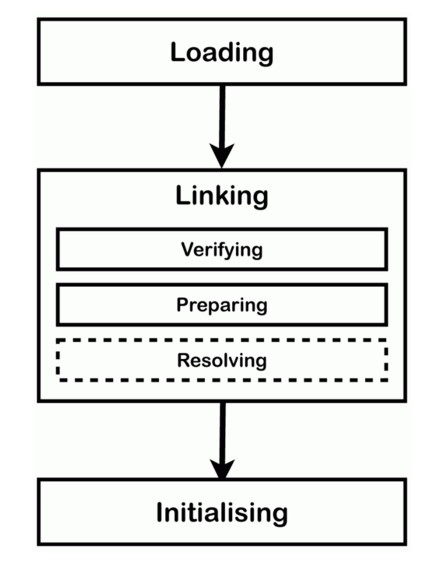
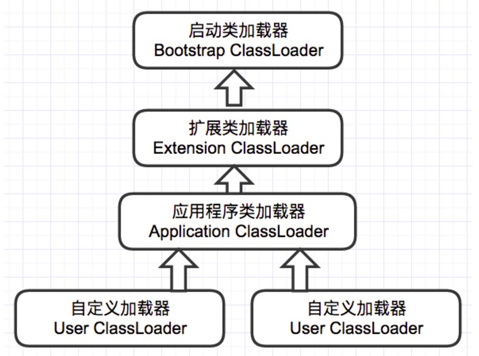

**修订记录**

| 时间 | 内容 |
|--------|--------|--------|
| 2017.08.15 | 初稿 |


## 概述
Java的类加载与那些在编译器进行连接的语言不同，它是在运行时完成的。 也就是说具备动态加载和动态连接的能力。

## 类加载的时机
类从被加载到VM内存，再到被卸载，至少要经过如下过程：加载、验证、准备、解析、初始化、使用、卸载 七个阶段。其中验证、准备、解析统一成为连接。


加载、验证、准备、初始化、卸载 这五个阶段的顺序是明确的，即类的加载顺序必须按部就班的按照这种方式进行。
而解析阶段则不一定。它在某种阶段会在初始化之后进行，比如java的动态绑定。

触发初始化操作的5种情况：

- 遇到new, getstatic, putstatic, invokestatic这四条指令时。如果类没有进行初始化操作，则首先进行初始化操作。具体的java场景是：new对象，读取和设置静态字段，调用静态方法。注意：被final修饰，已经在编译器把结果放入常量池的静态字段除外。
- 使用java.lang.reflect包进行反射调用时；
- 当初始化一个类时，如果其父类还没有初始化，则要先初始化父类。
- 虚拟机要先初始化包含main方法的主类。
- 对于JDK1.7中，如果一个java.lang.invoke.MethodHandle实例最后的解析结果是REF_getStatic,REF_putStatic,REF_invokeStatic的方法句柄时，并且这个句柄对应的类没有初始化，则需要先触发初始化。

具体的使用场景：
1.如果通过子类引用父类的静态字段，只会触发父类的初始化，而不会触发子类的初始化。
```java
public class SuperClass {
    static {
        System.out.println("super class init.");
    }

    public static int value = 123;
}

public class SubClass extends SuperClass {
    static {
        System.out.println("sub class init.");
    }
}

public class NotInitClass {
    public static void main(String[] args) {
        System.out.println(SubClass.value);
    }
}
```
最终的执行结果：
>super class init.
>123

也就是说并没有触发子类的初始化。

2.数组的初始化操作并不会触发原始类的初始化。
```java
public class NotInitClass2 {
    public static void main(String[] args) {
        SuperClass[] superClasses = new SuperClass[10];
    }
}
```
运行后，发现什么也没有输出。
这说明他并不会触发SuperClass的初始化，因为它触发的是[LSuperClass的初始化，它是一个数组，java会使用newarray指令进行初始化。

3.直接调用被final修饰的字符常量，不会引起类的初始化
```java
public class ConstClass {
    static {
        System.out.println("const class init");
    }

    public static final String Hello = "hello, world";
}

public class NotInitialize {
  public static void main(String[] args) {
    System.out.println(ConstClass.Hello);

    }
}
```
没有执行初始化块中的打印语句。

## 类加载过程
下面我们详细讨论下类加载的过程。
### 加载
加载主要完成下列三件事情：

- 通过类的全限定名获取类的二进制字节流。
- 将字节流的静态存储结构转换为方法区的运行时数据结构。
- 在内存中生成一个代表这个类的java.lang.Class对象，并作为方法区这个类的访问入口。

注意这里不一定非得要从一个Class文件获取，这里既可以从ZIP包中读取（比如从jar包和war包中读取），也可以在运行时计算生成（动态代理），也可以由其它文件生成（比如将JSP文件转换成对应的Class类）。

一个非数组类，获取类的二进制流可以由系统的加载器完成，也可以由用户自定义的加载器完成。
对于数组类，它本身并不通过类加载器创建，它是由java虚拟机直接创建的。

加载完成后，外部二进制字节流就会按照VM要求的格式存储到方法区中，然后内存中实例化一个java.lang.Class类的对象，这个对象作为程序访问方法区中的这些类型数据的外部接口。

加载和后面的连接阶段是交叉进行的。也即加载没有完成，连接阶段就开始了。

### 验证
这一阶段的主要目的是为了确保Class文件的字节流中包含的信息是否符合当前虚拟机的要求，并且不会危害虚拟机自身的安全。

class文件并不要求一定由java源代码编译而来，可以直接用十六进制编辑器直接生成class文件。虚拟机如果不检查输入的字节流，很有可能因为载入了有害的字节流而导致系统崩溃。

验证阶段主要会进行如下4个阶段的验证工作。

- 文件格式验证
- 元数据验证
- 字节码验证
- 符号引号验证

#### 1.文件格式验证
验证字节流是否符合class文件格式的规范。 验证点包括：

- 是否以魔数0xCAFEBABE开头
- 主、次版本号是否在当前虚拟机处理范围内
- 常量池中的常量是否有不被支持的常量类型（检查常量tag标志）
- 指向常量的各种索引值中是否有指向不存在的常量或者不符合类型的常量。
- CONSTANT_Utf8_info型的常量中是否有不符合UTF8编码的数据。
- Class文件中各个部分及文件本身是否有被删除的或附加的其他信息。
......

只有通过这个阶段的验证，字节流才会进入方法区进行存储。后面的3个校验环节全是在方法区的存储结构进行的，不会直接操作字节流。

#### 2.元数据验证
主要对字节码描述的信息进行语义分析，以保证描述的信息符合Java语言规范的要求。

验证点包括：

- 这个类是否有父类；
- 这个类的父类是否继承了不允许被继承的类（被final修饰的类）；
- 如果这个类不是抽象类，是否实现了其父类或接口要求实现的所有方法；
- 类中的字段、方法是否与父类产生矛盾。

#### 3.字节码验证
第二阶段是对元数据的数据结构进行校验，这个阶段主要对类的方法体进行校验，主要验证程序语义是否合法和符合逻辑。

- 保证任意时刻操作数栈的数据结构和指令代码序列都能配合工作，不能出现：在操作数栈放置了一个int类型的数据，使用时却按long类型来加载本地变量表。
- 保证跳转指令不会跳转到方法体以外的字节码指令上。
- 保证方法体中的类型转换是有效的。 不能出现：把父类赋值给子类的数据类型。

#### 4.符号引号验证
这个验证发生在link的第三步：解析阶段。即VM将把符号引用转化为直接引用的时候。
检查点包括：

- 符号引用中通过字符描述的全限定名是否能找到对应的类；
- 在指定的类中是否存在字段描述符以及简单名称所描述的方法和字段。
- 符号引用中的类、字段、方法的访问性是否可被当前类访问。
......

在验证阶段做这些检查意味着不需要在运行阶段做这些检查。链接阶段的检查减慢了类加载的速度，但是它避免了执行这些字节码时的多次检查。

这个过程不是必须的，可以通过-Xverify:none参数关闭。

### 准备
准备阶段是正式为类变量(被static修饰的变量)分配内存并设置类变量的初始值阶段，即在方法区中分配这些变量所使用的内存空间。

1）.这个阶段只进行类变量的分配，而不包含实例变量。实例变量的初始化将会随着对象的初始化一起完成。
2）.注意这里所说的初始值概念，一般初始为零值。
比如一个类变量定义为：
```java
public static int v = 8080;
```
实际上变量v在准备阶段过后的初始值为0而不是8080，将v赋值为8080是在初始化阶段完成，即putstatic指令是程序被编译后，存放于类构造器`<client>`方法之中

**注意**：前面提到，被final修饰的常量，是在编译阶段会生成ConstantValue属性，直接赋值了。
比如，
```java
public static final int v = 8080;
```
在准备阶段虚拟机会根据ConstantValue属性将v赋值为8080。

### 解析
解析阶段是指虚拟机将常量池中的符号引用替换为直接引用的过程。它包括通过加载引用的类和接口来检查这些符号引用是否正确。

解析是可选的阶段。如果不是发生在这个阶段，符号引用的解析要等到字节码指令使用这个引用的时候才会进行。

下面我们解释一下符号引用和直接引用的概念：

- 符号引用用以一组符号来描述所引用的目标，符号可以是任何形式的字面量。符号引用与虚拟机实现的布局无关，引用的目标并不一定要已经加载到内存中。各种虚拟机实现的内存布局可以各不相同，但是它们能接受的符号引用必须是一致的，因为符号引用的字面量形式明确定义在Java虚拟机规范的Class文件格式中。
- 直接引用可以是指向目标的指针，相对偏移量或是一个能间接定位到目标的句柄。如果有了直接引用，那引用的目标必定已经在内存中存在。直接引用和虚拟机实现的内存布局相关，同一个符号引用在不同的虚拟机实例上翻译出来的直接引用一般不会相同。

解析动作主要针对接口、字段、类方法、接口方法、方法类型、方法句柄、调用点限定符7类符号进行。分别对应于CONSTANT_Class_info、CONSTANT_Fieldref_info、CONSTANT_Methodref_info，CONSTANT_InterfaceMethodref_info、CONSTANT_MethodType_info、CONSTANT_MethodHandle_info、CONSTANT_InvokeDynamic_info等类型的常量中。


### 初始化
初始化阶段是类加载最后一个阶段，前面的类加载阶段之后，除了在加载阶段可以自定义类加载器以外，其它操作都由JVM主导。到了初始阶段，才开始真正执行类中定义的Java程序代码。

在准备阶段，变量已经赋过一次系统初始值，而在初始化阶段，则要执行类构造器`<clinit>`方法的过程。

1.`<clinit>`方法是由编译器自动收集类中所有的类变量赋值和静态语句块中的语句合并而成。
2.`<clinit>`方法和实例构造器`<init>`()不同，他不需要显示调用父类构造器，虚拟机会保证在子类的`<clinit>`方法执行之前，父类的`<clinit>`方法已经执行完成。
3.父类的静态块优先于子类的静态块执行。
4.如果一个类没有类变量或者静态语句块，则不需要生成`<clinit>`方法。
5.虚拟机会保证一个类的`<clinit>`方法在多线程环境中被正确的加载、同步。

注意以下几种情况不会执行类初始化：

- 通过子类引用父类的静态字段，只会触发父类的初始化，而不会触发子类的初始化。
- 定义对象数组，不会触发该类的初始化。
- 常量在编译期间会存入调用类的常量池中，本质上并没有直接引用定义常量的类，不会触发定义常量所在的类。
- 通过类名获取Class对象，不会触发类的初始化。
- 通过Class.forName加载指定类时，如果指定参数initialize为false时，也不会触发类初始化，其实这个参数是告诉虚拟机，是否要对类进行初始化。
- 通过ClassLoader默认的loadClass方法，也不会触发初始化动作。

## 类加载器
Java 的类加载器特点如下：

- 层次结构：Java 类加载器以父-子关系按层组织，Bootstrap 类加载器是所有类加载器的父节点。
- 代理模式：基于层级结构，加载是在类加载器之间代理实现。当一个类被加载时，父类加载器会检查并决定该类是否存在父类加载器中。如果父类加载器拥有这个类，就使用这个类。如果没有，类加载器就申请加载。
- 限制可见性：子类加载器可以查看父类加载器中的类；但是父类加载器不能查看子类加载器中的类。
- 不可卸载：类加载器可以加载类，但是不能卸载类。取代卸载的处理方法是：当前类加载器可以被删除，然后再创建一个新的类加载器。

注意：即使同一个class文件，如果用不同的classloader加载，则加载出来的对象是不同的。

JVM提供了3种类加载器：

- 启动类加载器(Bootstrap ClassLoader)：负责加载 JAVA_HOME\lib 目录中的，或通过-Xbootclasspath参数指定路径中的，且被虚拟机认可（按文件名识别，如rt.jar）的类。
- 扩展类加载器(Extension ClassLoader)：负责加载 JAVA_HOME\lib\ext 目录中的，或通过java.ext.dirs系统变量指定路径中的类库。
- 应用程序类加载器(Application ClassLoader)：负责加载用户路径（classpath）上的类库。

JVM通过双亲委派模型进行类的加载，如下图所示：

双亲委派模型要求除了顶层类加载器，其他类加载器都有自己的父加载器。

当一个类加载器收到类加载任务，会先交给其父类加载器去完成，因此最终加载任务都会传递到顶层的启动类加载器，只有当父类加载器无法完成加载任务时，才会尝试执行加载任务。

采用双亲委派的一个好处是比如加载位于rt.jar包中的类java.lang.Object，不管是哪个加载器加载这个类，最终都是委托给顶层的启动类加载器进行加载，这样就保证了使用不同的类加载器最终得到的都是同样一个Object对象。

当然我们也可以通过继承java.lang.ClassLoader实现自定义的类加载器。