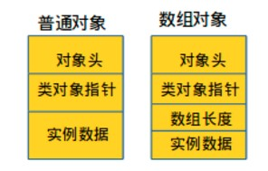
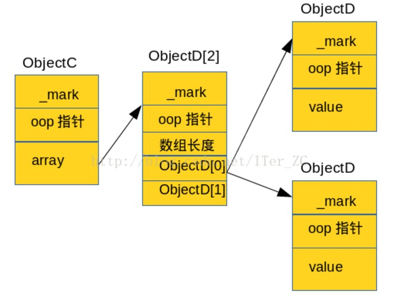

**修订记录**

| 时间 | 作者 | 内容 |
|--------|--------|--------|
| 2017.07.18 | 丁一 | 初稿 |

**普通对象**的结构如下，按64位机器的长度计算

1. 对象头(_mark)， 8个字节
2. Oop指针，如果是32G内存以下的，默认开启对象指针压缩，4个字节
3. 数据区
4. Padding(内存对齐)，按照8的倍数对齐

**数组对象**结构是

1. 对象头(_mark)， 8个字节
2. Oop指针，如果是32G内存以下的，默认开启对象指针压缩，4个字节
3. 数组长度，4个字节
4. 数据区
5. Padding(内存对齐)，按照8的倍数对齐



清楚了对象在内存的基本布局后，咱们说两种计算Java对象大小的方法
1. 通过java.lang.instrument.Instrumentation的getObjectSize(obj)直接获取对象的大小
2. 通过sun.misc.Unsafe对象的objectFieldOffset(field)等方法结合反射来计算对象的大小

## 普通对象大小
```java
private static class ObjectA {  
        String str;  // 4  
        int i1; // 4  
        byte b1; // 1  
        byte b2; // 1  
        int i2;  // 4   
        ObjectB obj; //4  
        byte b3;  // 1 
```

按照我们之前说的方法来计算一下这个对象所占大小，注意按8对齐
8(_mark) + 4(oop指针) + 4(str) + 4(i1) + 1(b1) + 1(b2) + 2(padding) + 4(i2) + 4(obj) + 1(b3) + 7(padding) = 40 ?

事实上，HotSpot创建的对象的字段会先按照给定顺序排列一下,默认的顺序如下，从长到短排列，引用排最后:  long/double --> int/float -->  short/char --> byte/boolean --> Reference
这个顺序可以使用JVM参数:  -XX:FieldsAllocationSylte=0(默认是1)来改变。

可以看到确实是**按照从长到短，引用排最后**的方式在内存中排列的。按照这种方法我们来重新计算下ObjectA创建的对象的长度:
8(_mark) + 4(oop指针) + 4(i1) + + 4(i2) + 1(b1) + 1(b2) + 1(b3) + 1(padding) +  4(str) + 4(obj) = 32

## 数组对象大小
后再来测试一下数组对象的长度。有两个类如下:
```java
    private static class ObjectC {  
        ObjectD[] array = new ObjectD[2];  
    }  
      
    private static class ObjectD {  
        int value;  
    }  
```
它们在内存的大体分布如下图:


我们可以手工计算一下ObjectC obj = new ObjectC()的大小：
ObjectC的Shallow size = 8(_mark) + 4(oop指针)  + 4(ObjectD[]引用) = 16
new ObjectD[2]数组的长度 =  8(_mark) + 4(oop指针) + 4(数组长度占4个字节) + 4(ObjectD[0]引用) + 4(ObjectD[1]引用) = 24
ObjectD对象长度 = 8(_mark) + 4(oop指针) + 4(value) = 16
所以ObjectC实际占用的空间 = 16 + 24 + 2 * 16 = 72

