**修订记录**

| 时间 | 作者 | 内容 |
|--------|--------|--------|
| 2017.08.07 | 丁一 | 初稿 |

## 1.垃圾收集算法
### 1.1.标记-清除
此算法执行分两阶段。第一阶段从引用根节点开始标记所有被引用的对象，第二阶段遍历整个堆，把未标记的对象清除。此算法需要暂停整个应用，同时，会产生内存碎片。
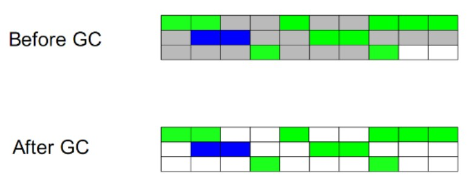

### 1.2.复制
此算法把内存空间划为两个相等的区域，每次只使用其中一个区域。垃圾回收时，遍历当前使用区域，把正在使用中的对象复制到另外一个区域中。此算法每次只处理正在使用中的对象，因此复制成本比较小，同时复制过去以后还能进行相应的内存整理，不会出现“碎片”问题。当然，此算法的缺点也是很明显的，就是需要两倍内存空间。
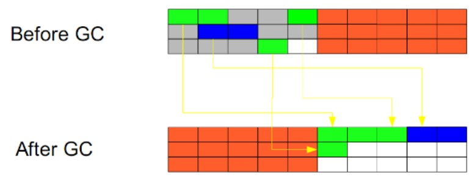

### 1.3.标记-整理
此算法结合了“标记-清除”和“复制”两个算法的优点。也是分两阶段，第一阶段从根节点开始标记所有被引用对象，第二阶段遍历整个堆，把清除未标记对象并且把存活对象“压缩”到堆的其中一块，按顺序排放。此算法避免了“标记-清除”的碎片问题，同时也避免了“复制”算法的空间问题。
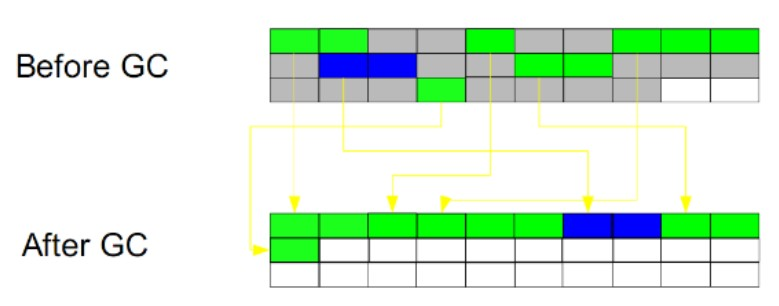

## 2.垃圾收集分类
### 2.1.按“分代”分类
#### Minor GC
GC用较高的频率对young进行扫描和回收，采用复制算法。

#### Major GC/Full GC
同时对Young和Old进行内存收集，也叫Full GC；因为成本关系对Old的检查回收频率要比Young低很多，采用标记清除/标记整理算法。

1. Full GC == Major GC指的是对老年代/永久代的stop the world的GC
2. Full GC的次数 = 老年代GC时 stop the world的次数
3. Full GC的时间 = 老年代GC时 stop the world的总时间
4. CMS 不等于Full GC，我们可以看到CMS分为多个阶段，只有stop the world的阶段被计算到了Full GC的次数和时间，而和业务线程并发的GC的次数和时间则不被认为是Full GC
5. Full GC本身不会先进行Minor GC，我们可以配置，让Full GC之前先进行一次Minor GC，因为老年代很多对象都会引用到新生代的对象，先进行一次Minor GC可以提高老年代GC的速度。比如老年代使用CMS时，设置CMSScavengeBeforeRemark优化，让CMS remark之前先进行一次Minor GC。

### 2.2.按“系统进程”分类
#### 串行收集
串行收集使用单线程处理所有垃圾回收工作，因为无需多线程交互，实现容易，而且效率比较高。但是，其局限性也比较明显，即无法使用多处理器的优势，所以此收集适合单处理器机器。比如新生代Serial和老年代Serial Old收集器。
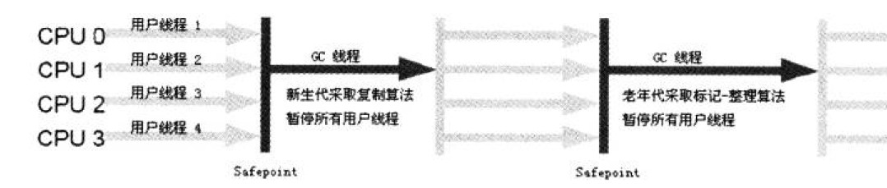

#### 并行收集
并行收集使用多线程处理垃圾回收工作，因而速度快，效率高。而且理论上CPU数目越多，越能体现出并行收集器的优势。但回收的过程需要暂定用户程序。比如新生代ParNew、Parallel Scavenge和老年代Parallel Old收集器。
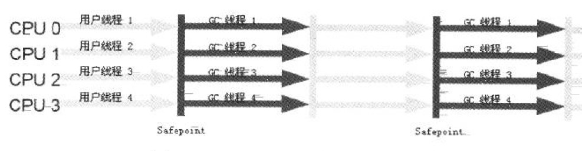

#### 并发收集
也是使用多线程收集。但是在执行垃圾收集的同时，可以同时执行用户线程。 比如老年代CMS收集器。
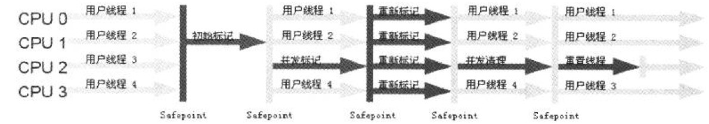

### 2.3.方法区（永久代）的回收
方法区主要的回收对象是废弃常量和无用的类。

废弃常量和无引用的对象一样，如果常量池中的常量没有没使用，则可以认为是废弃常量，允许回收。

那如何才能判断是无用的类呢？ 需要满足下面3个条件：

- 该类所有的实例都已经被回收，也就是Java堆中不存在该类的任何实例。
- 加载该类的ClassLoader已经被回收。
- 该类对应的java.lang.Class对象没有在任何地方被引用，无法在任何地方通过反射访问该类的方法。

在大量使用反射、动态代理、CGLib框架、动态生成JSP以及OSGi场景中，需要虚拟机具备类卸载的能力，防止永久代不会溢出。

## 3.垃圾收集器
### 3.1.垃圾收集器概览

| 分代 | 收集器 | 描述 | 回收算法 |使用场景 | 备注 |
|--------|--------|
| 新生代       |  Serial | 串行收集 | 复制 |常用于client模式 | |
| 新生代       |  ParNew | 并行收集 | 复制 | CMS收集器的默认新生代收集器 |
| 新生代       |  Parallel Scavenge  | 并行收集 | 复制  | 吞吐量优先 | |
| 老年代       |  Serial Old      | 串行收集 | 标记-整理 | | |
| 老年代       |  Parallel Old      | 并行收集 | 标记-整理 | | |
| 老年代       |  CMS      | 并发收集 | 标记-清除| | |
| 老年代       |  G1      | | | | |

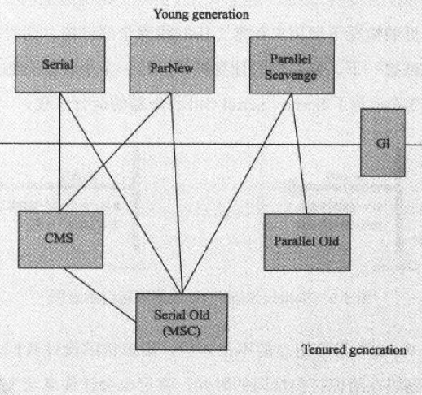

和收集器相关的JVM参数

| 参数 | 描述 |
|--------|--------|
| UseSerialGC | 虚拟机运行在client模式下的默认值。使用Serial+Serial Old收集器进行垃圾回收 |
| UseParNewGC | 虚拟机运行在server模式下的默认值。使用ParNew + Serial Old组合收集器|
| UseParallelGC | 虚拟机运行在server模式下的默认值。使用Parallel Scavenge + Serial Old组合收集器 |
| UseParallelOldGC| 使用Parallel Scavenge + Parallel Old组合收集器 |
| UseConcMarkSweepGC | 使用ParNew + CMS组合收集器，如果CMS收集器出现concurrent mode failure，则启用Serail Old收集器 |
| UseG1GC | 启用G1回收器 |

### 3.2.Serial回收器（新生代）
Serial收集器是Hotspot运行在Client模式下的默认新生代收集器, 它的特点是 只用一个CPU/一条收集线程去完成GC工作, 且在进行垃圾收集时必须暂停其他所有的工作线程(“Stop The World”--STW)。

虽然是单线程收集, 但它却简单而高效, 在VM管理内存不大的情况下(收集几十M~一两百M的新生代), 停顿时间完全可以控制在几十毫秒~一百多毫秒内。

### 3.3.ParNew回收器（新生代）
ParNew收集器其实是前面Serial的多线程版本, 除使用多条线程进行GC外, 包括Serial可用的所有控制参数、收集算法、STW、对象分配规则、回收策略等都与Serial完全一样(也是VM启用CMS收集器-XX: +UseConcMarkSweepGC的默认新生代收集器)。

由于存在线程切换的开销, ParNew在单CPU的环境中比不上Serial, 且在通过超线程技术实现的两个CPU的环境中也不能100%保证能超越Serial。但随着可用的CPU数量的增加, 收集效率肯定也会大大增加(ParNew收集线程数与CPU的数量相同，因此在CPU数量过大的环境中。

#### ParNew收集器相关JVM参数：

| 参数 | 描述 |
|--------|--------|
| ParallelGCThreads|  并行收集时的GC线程数|

### 3.4.Parallel Scavenge回收器（新生代）
Parallel Scavenge也是使用复制算法, 也是并行多线程收集器. 但与其他收集器关注尽可能缩短垃圾收集时间不同, Parallel Scavenge更关注系统吞吐量。

停顿时间越短就越适用于用户交互的程序-良好的响应速度能提升用户的体验;而高吞吐量则适用于后台运算而不需要太多交互的任务-可以最高效率地利用CPU时间,尽快地完成程序的运算任务。

#### Parallel Scavenge收集器相关JVM参数：

| 参数 | 描述 |
|--------|--------|
| MaxGCPauseMillis | （毫秒数）收集器将尽力保证内存回收话费的时间不超过设定值，但如果太小将会导致GC的频率增加。 |
| GCTimeRatio | (整数：`0<GCTimeRatio<100`)是垃圾收集时间占总时间的比率 |
| -XX:UseAdaptiveSizePolicy | 启用GC自适应调节策略；不再手工指定-Xmn，-XX:SurvirorRatio、-XX: PretenureSizeThreshhold等细节参数，VM会根据当前系统的运行情况收集性能监控信息，动态调整这些参数以提供最合适的停顿时间或最大的吞吐量 |

### 3.5.Serial Old回收器（老年代）
Serial Old是Serial收集器的老年代版本, 同样是单线程收集器,使用“标记-整理”算法:

应用场景如下:

- JDK 1.5之前与Parallel Scavenge收集器搭配使用;
- 作为CMS收集器的后备预案, 在并发收集发生Concurrent Mode Failure时启用


### 3.6.Parallel Old回收器（老年代）
Parallel Old是Parallel Scavenge收老年代版本, 使用多线程和“标记－整理”算法, 吞吐量优先, 主要与Parallel Scavenge配合在 注重吞吐量 及 CPU资源敏感 系统内使用。

### 3.7.CMS回收器（老年代）
CMS(Concurrent Mark Sweep)收集器是一款真正意义上的并发收集器。

CMS是一种以获取最短回收停顿时间为目标的收集器(CMS又称多并发低暂停的收集器), 基于”标记-清除”算法实现, 整个GC过程分为以下4个步骤:

1. 初始标记(CMS initial mark)
2. 并发标记(CMS concurrent mark: GC Roots Tracing过程)
3. 重新标记(CMS remark)
4. 并发清除(CMS concurrent sweep: 已死象将会就地释放, 注意: 此处没有压缩)

其中两个加粗的步骤(初始标记、重新标记)仍需STW. 但初始标记仅只标记一下GC Roots能直接关联到的对象, 速度很快; 而重新标记则是为了修正并发标记期间因用户程序继续运行而导致标记产生变动的那一部分对象的标记记录, 虽然一般比初始标记阶段稍长, 但要远小于并发标记时间。

由于整个GC过程耗时最长的并发标记和并发清除阶段的GC线程可与用户线程一起工作, 所以总体上CMS的GC过程是与用户线程一起并发地执行的。

由于CMS收集器将整个GC过程进行了更细粒度的划分, 因此可以实现并发收集、低停顿的优势, 但它也并非十分完美, 其存在缺点及解决策略如下:

1.CMS默认启动的回收线程数=(CPU数目+3)4
当CPU数>4时, GC线程最多占用不超过25%的CPU资源, 但是当CPU数<=4时, GC线程可能就会过多的占用用户CPU资源, 从而导致应用程序变慢, 总吞吐量降低。

2.无法处理浮动垃圾。浮动垃圾是指在CMS并发清理阶段用户线程运行而产生的新垃圾。 由于在GC阶段用户线程还需运行, 因此还需要预留足够的内存空间给用户线程使用, 导致CMS不能像其他收集器那样等到老年代几乎填满了再进行收集. 因此CMS提供了-XX:CMSInitiatingOccupancyFraction参数来设置GC的触发百分比(以及-XX:+UseCMSInitiatingOccupancyOnly来启用该触发百分比), 当老年代的使用空间超过该比例后CMS就会被触发(JDK 1.6之后默认92%). 但当CMS运行期间预留的内存无法满足程序需要, 就会出现上述Promotion Failure等失败, 这时VM将启动后备预案: 临时启用Serial Old收集器来重新执行Full GC(CMS通常配合大内存使用, 一旦大内存转入串行的Serial GC, 那停顿的时间就是大家都不愿看到的了)。

3.由于CMS采用”标记-清除”算法实现, 可能会产生大量内存碎片. 内存碎片过多可能会导致无法分配大对象而提前触发Full GC。 因此CMS提供了-XX:+UseCMSCompactAtFullCollection开关参数, 用于在Full GC后再执行一个碎片整理过程。 但内存整理是无法并发的, 内存碎片问题虽然没有了, 但停顿时间也因此变长了, 因此CMS还提供了另外一个参数-XX:CMSFullGCsBeforeCompaction用于设置在执行N次不进行内存整理的Full GC后, 跟着来一次带整理的(默认为0: 每次进入Full GC时都进行碎片整理)。

#### CMS收集器相关JVM参数：

| 参数 | 描述 |
|--------|--------|
| -XX:CMSInitiatingOccupancyFraction | 设置GC的触发百分比 |
| -XX:+UseCMSInitiatingOccupancyOnly | 启用该触发百分比 |
| -XX:+UseCMSCompactAtFullCollection | 用于在Full GC后再执行一个碎片整理 |
| -XX:CMSFullGCsBeforeCompaction | 设置在执行N次不进行内存整理的Full GC后, 跟着来一次带整理的（(默认为0: 每次进入Full GC时都进行碎片整理)） |


### 3.8.G1收集器（分区收集）
G1(Garbage-First)是一款面向服务端应用的收集器, 主要目标用于配备多颗CPU的服务器治理大内存。

G1收集器的特点：

**并行和并发**
G1可以充分的利用多核CPU来缩短STW的时间。

**分代收集：**
虽然G1可以不需要像其他收集器配合就能独立管理整个GC堆，但它能采用不同的方式新创建和已经存活的对象。

**空间整合**
G1从整体是是“标记-整理”算法收集，局部（2个region）又是复制算法。这意味G1不会产生内存碎片，这样就不会出现大对象因为无法找到合适的内存而无法分配的情况。

**可预测的停顿**
G1除了最求低停顿外，还能建立可预测的停顿时间模型。

在G1中，堆被划分成 许多个连续的区域(region)。每个区域大小相等，在1M~32M之间。JVM最多支持2000个区域，可推算G1能支持的最大内存为2000*32M=62.5G。区域(region)的大小在JVM初始化的时候决定，也可以用-XX:G1HeapReginSize设置。

在G1中没有物理上的Yong(Eden/Survivor)/Old Generation，它们是逻辑的，使用一些非连续的区域(Region)组成的。
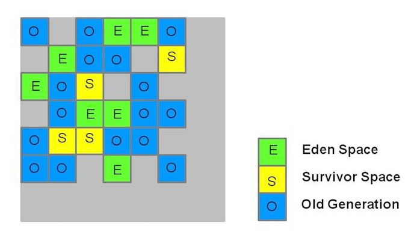

每块区域既有可能属于新生代区、也有可能是老年代区, 因此不需要一次就对整个老年代/新生代回收。 而是当线程并发寻找可回收的对象时, 有些区块包含可回收的对象要比其他区块多很多. 虽然在清理这些区块时G1仍然需要暂停应用线程, 但可以用相对较少的时间优先回收垃圾较多的Region(这也是G1命名的来源). 这种方式保证了G1可以在有限的时间内获取尽可能高的收集效率。

#### 新生代收集
G1的新生代收集特点如下:

- 一整块堆内存被分为多个Regions。
- 存活对象被拷贝到新的Survivor区或老年代。
- 年轻代内存由一组不连续的heap区组成, 这种方法使得可以动态调整各代区域尺寸。
- Young GCs会有STW事件, 进行时所有应用程序线程都会被暂停。
- 多线程并发GC。

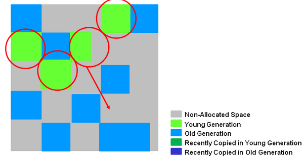

G1的新生代收集跟ParNew类似: 存活的对象被转移到一个/多个Survivor Regions。如果存活时间达到阀值， 这部分对象就会被提升到老年代。
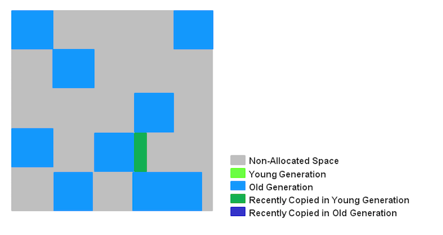

#### 老年代收集
G1老年代GC会执行以下阶段: (以下有些阶段也是新生代垃圾收集的一部分)

| 序号 | 步骤 | 描述 |
|--|--|--|
| 1 | 初始标记 (Initial Mark: Stop the World Event) | 在G1中, 该操作附着一次新生代GC, 以标记Survivor中有可能引用到老年代对象的Regions|
| 2 | 扫描根区域 (Root Region Scanning: 与应用程序并发执行) | 扫描Survivor中能够引用到老年代的references，但必须在Minor GC触发前执行完。 |
| 3 |并发标记 (Concurrent Marking : 与应用程序并发执行)  | 在整个堆中查找存活对象, 但该阶段可能会被Minor GC中断 |
| 4 | 重新标记 (Remark : Stop the World Event) | 完成堆内存中存活对象的标记. 使用snapshot-at-the-beginning(SATB, 起始快照)算法, 比CMS所用算法要快得多(空Region直接被移除并回收, 并计算所有区域的活跃度) |
| 5 | 清理 (Cleanup : Stop the World Event and Concurrent) |  |
| 5.1 | Stop the world | 在含有存活对象和完全空闲的区域上进行统计 |
| 5.2 | Stop the world | 擦除Remembered Sets. |
| 5.3 | Concurrent | 重置空regions并将他们返还给空闲列表(free list) |
| * | Copying/Cleanup (Stop the World Event) | 选择”活跃度”最低的区域(这些区域可以最快的完成回收)。 拷贝/转移存活的对象到新的尚未使用的regions。<br>该阶段会被记录在gc-log内(只发生年轻代[GC pause (young)], 与老年代一起执行则被记录为[GC Pause (mixed)] |

下面分阶段描述：
##### 1.初始标记阶段 
初始标记主要在新生代标记进行gc的区域，会暂停GC。log中显示：GC pause (young)(inital-mark)。
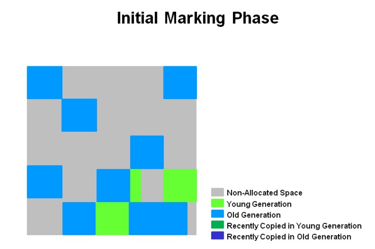

##### 2.并发标记阶段 
标记空区域（下面中X号）,在与应用程序并发执行的过程中会计算活跃度信息
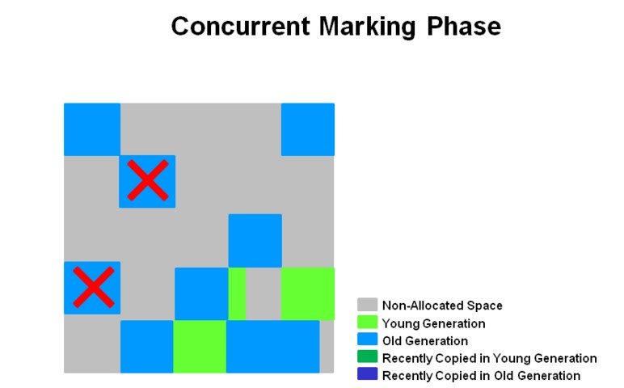

##### 3.重新标记阶段
清除空区域。重新计算整个区域的活跃度。
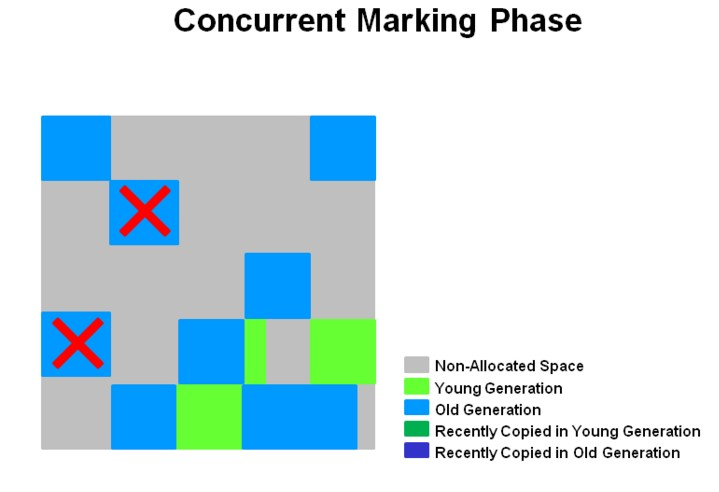

##### 4.复制/清除阶段
对最低活跃度的区域进行快速清除。
同时对新生代和老年代的区域进行清除。在log上显示为：[GC pause (mixed)]

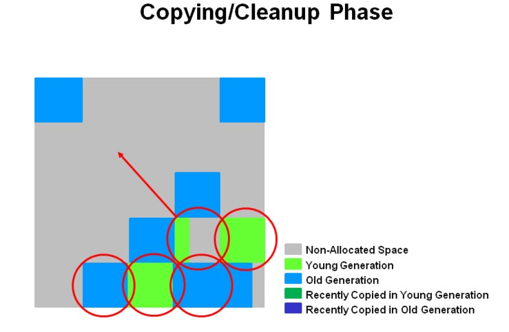

##### 5.复制/清除之后阶段
清理后剩余的对象被压缩到新的区域上。下图深蓝和深绿的区域。
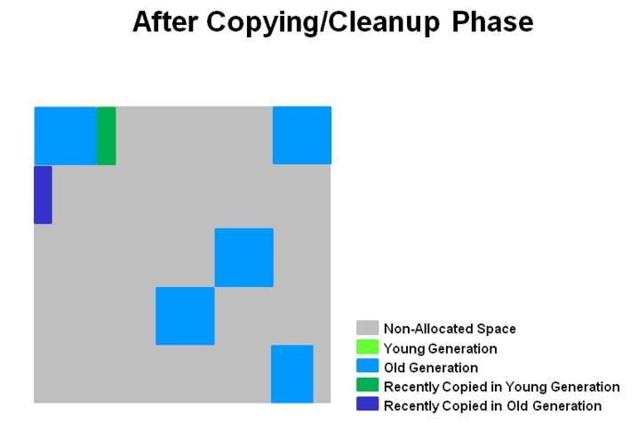

老年代的收集特点总结如下：

**1.并发标记阶段(index 3)**
在与应用程序并发执行的过程中会计算活跃度信息。这些活跃度信息标识出那些regions最适合在STW期间回收。
不像CMS有清理阶段。

**2.再次标记阶段(index 4)**
使用Snapshot-at-the-Beginning(SATB)算法比CMS快得多。
空region直接被回收。

**3.拷贝/清理阶段(Copying/Cleanup Phase)**
年轻代与老年代同时回收。
老年代内存回收会基于他的活跃度信息。

在G1中，Region之间的对象引用以及其他收集器中的新生代与老年代之间的对象引用，是存储在RememberedSet中的，以避免全局扫描。类似其他收集器中OopMap的作用。G1中的每个region都有一个与之对应的RememberedSet。

## 4.GC日志
### Oracle JDK 
下面是minor gc时的日志：

```
764.257: [GC 764.258: [DefNew: 115135K->12736K(115136K), 0.2654858 secs] 1006744K->926708K(1138240K), 0.265555 
```
含义：
```java
[GC [<collector>: <starting occupancy1> -> <ending occupancy1>, <pause time1> secs] <starting occupancy3> -> <ending occupancy3>, <pause time3> secs]
<collector>              GC收集器的名称
<starting occupancy1>    新生代在GC前占用的内存
<ending occupancy1>      新生代在GC后占用的内存
<pause time1>            新生代局部收集时jvm暂停处理的时间
<starting occupancy3>    JVM Heap 在GC前占用的内存，新生代+老生代的大小。
<ending occupancy3>      JVM Heap 在GC后占用的内存
 <pause time3>           GC过程中jvm暂停处理的总时间 
```

GC日志中的GC和Full GC说明这次垃圾回收的停顿类型，而不是区分新生代还是老年代GC的。如果有Full，说明这次GC发生了STW，比如ParNew的收集也会打印Full GC。

DefNew表示Default New Generation，表示Serial收集器。
ParNew表示ParNew收集器。
PSYoungGen表示paralle scavenge收集器。

以下是分析：
DefNew: 115135K->12736K(115136K), 0.2654858 secs
新生代可用空间115136K，回收前115135K，回收后12736K，回收了102399K，暂停了0.2654858秒。

1006744K->926708K(1138240K), 0.265555
堆内存可用1138240K，回收前1006744K，回收后926708K，回收了80036K，总暂停时间265555秒。

这说明，还有102399K －80036K ＝22363K内存没有被回收，提升到了年老代。
其中的

下面是full gc时的日志：

```java
[Full GC 5.522: [Tenured: 21332K->17408K(23864K), 0.1569256 secs] 22574K->17408K(25720K), [Perm : 32767K->32767K(32768K)], 0.1570581 secs] [Times: user=0.16 sys=0.00, real=0.16 secs]
```

下面是关闭java程序后，打出堆内存汇总日志：

```java
Heap
 def new generation   total 3776K, used 1452K [0x169d0000, 0x16de0000, 0x16eb0000)
  eden space 3392K,  33% used [0x169d0000, 0x16ae9070, 0x16d20000)
  from space 384K,  85% used [0x16d80000, 0x16dd2220, 0x16de0000)
  to   space 384K,   0% used [0x16d20000, 0x16d20000, 0x16d80000)
 tenured generation   total 49356K, used 32316K [0x16eb0000, 0x19ee3000, 0x1a9d0000)
   the space 49356K,  65% used [0x16eb0000, 0x18e3f0f8, 0x18e3f200, 0x19ee3000)
 compacting perm gen  total 36096K, used 35972K [0x1a9d0000, 0x1cd10000, 0x2a9d0000)
   the space 36096K,  99% used [0x1a9d0000, 0x1ccf1068, 0x1ccf1200, 0x1cd10000)
    ro space 8192K,  66% used [0x2a9d0000, 0x2af20f10, 0x2af21000, 0x2b1d0000)
    rw space 12288K,  52% used [0x2b1d0000, 0x2b8206d0, 0x2b820800, 0x2bdd0000)
```
