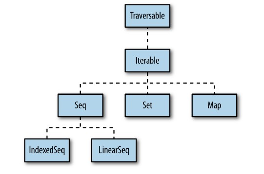
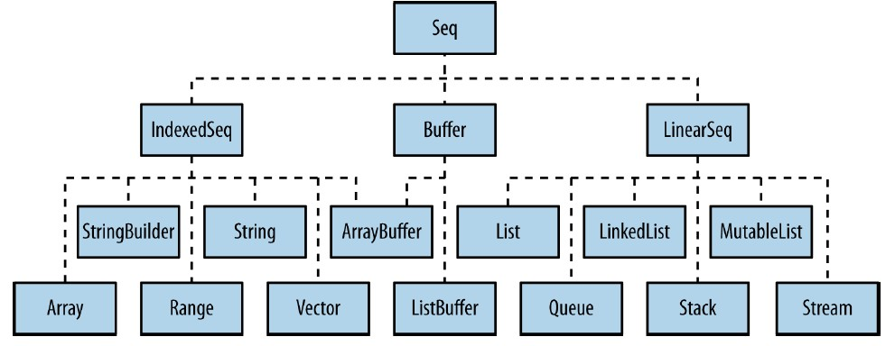
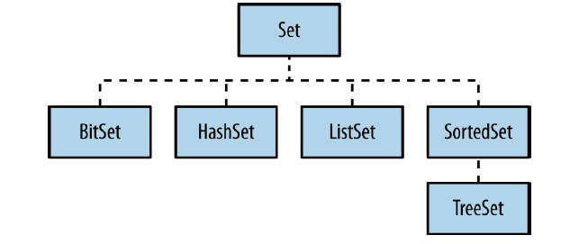
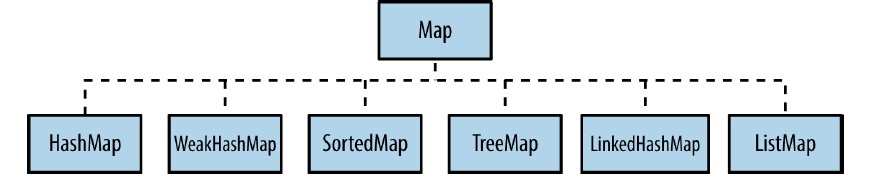

# Learning Scala: 集合

修订记录

| 时间 | 作者 | 内容 |
|--------|--------|--------|
| 2016.11.7 | 丁一 | 初稿 |

[TOC]

## 集合的继承体系
Scala集合的继承体系远比Java的复杂。
先看一张高层继承图：

上面显示的都是Trait，主要分为Seq，Set，Map三大类。
下面是 **Seq** 的继承图：

主要从IndexedSeq, LinearSeq, Buffer三个Trait下继承。
再看一个 **Set** 的继承体系图：

看着清爽了许多。
最后看一个 **Map** 的继承体系图：

虽然上面的四张图不是Scala集合的全部实现，但从中可以概览Scala集合的全貌。在加入了可变/不可变，并发/并行等特性后，让Scala的集合体系变得非常庞大。
下面的文章仅介绍比较常用的集合实现。

## Seq
Seq是一个有先后顺序的序列。
IndexedSeq允许通过数组下标快速访问元素。
LinearSeq是一个由头元素+尾集合组成的集合。

### 不可变的Seq
#### List
List是Seq的默认实现，它是有序且不可变的。

##### List的创建方式
方法1：通过隐式调用apply()方法创建
比如
> val numbers = List(1, 2, 3)

方法2：通过::操作符创建
比如：
> val numbers = 1 :: 2 :: 3 :: Nil

::操作符是右结合的，比如 A::B::C 等同于 A::(B::C)

##### List的类型
列表中的元素是同质的，即列表中的元素类型是相同的。
下面是几个例子：
```scala
  val word: List[String] = List("one", "two", "three")
  val matrix: List[List[Int]] = List(
      List(1, 2, 3),
      List(4, 5, 6),
      List(7, 8, 9)
  )  
  val number: List[AnyVal] = List(1, 2.3d)
  val any: List[Any] = List(1, "one")
  val empty: List[Nothing] = List()
```
List的类型是协变的(convariant)，即可以包含类型T以及子类型S。比如1和2.3d的元素可以包含在类型为AnyVal的列表中，
空列表的类型是Nonthing。

##### List的的基本操作
List的基本操作主要包含下面的三种：

- head: 返回列表的第一个元素。
- tail: 返回列表除第一个元素的其他元素列表。
- isEmpty：列表是否为空。

下面是一些例子：
```scala
  word.head  // one
  word.tail.head  // two
  matrix.head  // List(1, 2, 3)
  empty.isEmpty  // true
```
#### Vector
继承自IndexedSeq，它是不可变的，可以通过下标进行元素的随机访问。
Vector是树形结构存储的，每个节点不超过32个子节点。所以对于100万个元素的Vector而言，只需要四层节点。
由于它的高效存储结构，应该是我们访问数据的第一个选择。
Vector不太适合频繁执行头/尾的分解操作，这种场景最好使用List。

#### Range
继承自IndexedSeq。它表示一个整数序列。Range并不存储全部值，仅存储起始值、结束值和增量值。

下面是一些常用操作：
```scala
1 to 4  // 包含下限，Range(1, 2, 3, 4)
1 until 4  // 不包含下限，Range(1, 2, 3)
1 to 4 by 2  // 增量，Range(1, 3)
```
#### Stream
Stream是一个不可变的无限流列表。它只有在调用的时候才取元素，所以是延迟计算的。 
比如下面的例子：
```scala
def numsFrom(n: BigInt) : Stream[BigInt] = n #:: numsFrom(n + 1)

val tenOrMore = numsFrom(10)  // Stream(10, ?)
tenOrMore.tail.tail  // Stream(12, ?)
val squares = numsFrom(1).map(_ * 2)  // Stream(2, ?)
squares.take(5).force  // Stream(2, 4, 6, 8, 10)

```
可以看到，Stream中的元素连接使用操作符#::(还嫌Scala的集合操作符不够多？)
Stream是一个无限流，一般用(head, ?)的形式表示。
Stream经过map操作后也是一个Stream。
如果要从Stream中取出元素可以用take(n).force。

我们还可以从迭代器构造一个流，比如从Source.getLines返回一个Iterator。这个迭代器只能访问一次数据，但如果转换成Stream后，就可以缓存访问过的行，允许重新访问。
下面是一个例子：
```java
  val words = Source.fromFile("words.txt").getLines().toStream
  words // Stream("first line", ?)
  words(3)  // Stream("third line", ?)
  words // Stream("first line", "second line", "third line", ?)
```

### 可变的Seq
#### ArrayBuffer
ArrayBuffer是一个可变数组，当元素插入ArrayBuffer时，如果ArrayBuffer的数组没满，则直接插入。如果当前数组已满，则会新建一个更大的数组，把当前数组拷贝过去。
ArrayBuffer类似于Java的ArrayList。适用于可变数组的场景。

#### LinkedList
LinkedList是List的可变版本，它可以通过对elem引用赋值来修改其头部，对next引用赋值修改其尾部。
一个例子：
```scala
  val linkedList = scala.collection.mutable.LinkedList(1, -2, 3, -4)
  var currentList = linkedList
  while (currentList != Nil) {
      if (currentList.elem < 0) currentList.elem = 0
      currentList = currentList.next
  }
```
通过循环把所有负值都改成0，输出结果为：
> 1, 0, 3, 0

## Set
Set是无序且不允许有重复元素的集合。
Set(1, 2, 3) + 1 和Set(1, 2, 3)的效果是一样的。
Set中存储元素也是无序的，对于Set(1,2,3,4,5)，访问时，顺序有可能是5, 1, 2, 3, 4。
如果想要使用已排序的Set，可以使用SortedSet，比如
scala.collection.immutable.SortedSet(1,2,3)。内部排序使用红黑树实现的。

## Map
Map是不可变的，创建方式和List、Set类似：
> val errorCode = Map(1 -> "one", 2 -> "two", 3 -> "three")

使用(key)的方式就可以访问对应的键值。
> errorCode(1)

Map可以用作从键类型到值类型的偏函数：
> val code = List(1, 2).map(errorCode)

输出结果为：List(one, two)

Map还可以提供无匹配键值时是默认值。比如，
>val defaultErrorCode = Map(1 -> "one", 2 -> "two").withDefaultValue("other")
>defaultErrorCode(3)

由于3不在map的主键中，所以值结果返回默认值：other。

## 集合的常用操作符
Scala的集合操作符初看起来非常复杂，也很容易让人迷惑。

| 操作符 | 适用集合 | 描述 |
|--------|--------|--------|
| collect :+ elem | Seq | 将元素elem加入到集合的尾部 |
| elem +: collect | Seq | 将元素elem插入到集合的头部 |
| collect + elem| Set/Map | 将元素加入到集合中 |
| collect + (e1,e2..)| Set/Map | 将多个元素加入到集合中 |
| collect - elem| Set/Map | 将元素从集合中移除 |
| collect - (e1,e2..)| Set/Map | 将多个元素从集合中移除 |
| collect1 ++ collect2 | Iterable | 将两个集合的元素合并 |
| collect1 -- collect2 | Set/Map/ArrayBuffer | 将两个集合中的公共元素移除 |
| elem :: list | List | 把元素加入到List中 |
| list2 ::: list1 | List | 两个list连接 |
| collect += elem | 可变集合 | 向集合中添加新元素 |
| collect += (e1, e2..) | 可变集合 | 向集合中添加多个元素 |
| collect1 ++= collect2 | 可变集合 | 向集合中添加另一个集合 |
| collect -= elem | 可变集合 | 从集合删除一个元素 |
| collect -= (e1, e2..) | 可变集合 | 从集合中删除多个元素 |
| collect1 --= collect2 | 可变集合 | 从集合中删除另一个集合 |

从上面看似“找不同”的操作符中，可以总结出如下规律：

- 向后(:+)或向前(+:)操作符追加元素到序列中。
- 添加(+)操作符添加元素到无先后顺序的集合中。
- 用(-)操作符移除元素。
- 用++和--操作符批量添加和删除元素。
- 对于列表，优先使用::和:::操作符。
- 改值操作符有：+=，++=，-=,--=。

下面是一些例子：
```scala
Vector(1, 2, 3) :+ 4 // Vector(1, 2, 3, 4
1 +: Vector(2, 3, 4) // Vector(1, 2, 3, 4
val arrayBuffer = ArrayBuffer(1, 2, 3)
arrayBuffer += 4  // ArrayBuffer(1, 2, 3, 4)
var set = Set(5, 7, 1, 2, 3)
set += 4  // Set(5, 1, 2, 7, 3, 4)
var vector = Vector(1, 2, 3)
vector :+= 4   // Vector(1, 2, 3, 4)
val newSet1 = set - 2 // Set(5, 1, 7, 3, 4)
val newSet2 = set ++ Set(8, 9) // Set(5, 1, 9, 2, 7, 3, 8, 4)
```
从中可以看出，虽然Set,Vector是不可变的，但可以把变量声明为var，这样就可以通过+=或:+=操作对集合进行修改操作了。 

## 集合的常用方法
| 函数名 | 描述 | 例子 |
|--------|--------|--------|
| length | 获取列表的长度 |  |
| last | 获取最后一个元素  | List(1,2,3).last // 3 |
| init | 获取除最后一个元素外的其他元素列表 | List(1,2,3).init // List(1,2) |
| take(n) | 获取集合中的前n个元素 | List(1,2,3).take(2) // List(1,2) |
| drop(n) | 获取n+1的位置开始的元素列表 | List(1,2,3).drop(2) // List(3) |
| splitAt(n) | 从第n个元素分割成两个列表 | List(1,2,3).splitAt(2) // (List(1,2),List(3))  |
| indices | 获取集合的下标列表 | List(1,2,3).indices // List(0,1,2) |
| zip | 对两个集合进行拉链操作，形成元组列表。 | List(1, 2).zip(List("one", "two")) // List((1,one), (2,two)) |
| zipAll | 如果两个结合的长度不匹配，则提供默认值进行zip操作 | List(1, 2, 3).zipAll(List("one", "two"), 6, "zero") // List((1,one), (2,two), (3,zero)) |
| zipWithIndex | 以元素下标进行zip操作 | List(1, 2, 3).zipWithIndex // List((1,0), (2,1), (3,2)) |
| mkString | 按照分隔符拆分列表，生成字符串。如果分隔符为空，则默认按逗号分隔。 | List(1,2,3).mkString("[", "-", "]") // [1-2-3] |
| toArray | 转成Array类型 | List(1,2,3).toArray // Array(1,2,3) |
| reverse | 反转列表 | List(1,2,3).reverse // List(3,2,1)  |
| map(f) | 映射  |  |
| flatMap(f) | 映射展平 |  |
| foreach(f) | 遍历集合 |  |
| filter(pred) | 过滤元素 |  |
| find(pred) | 返回第一个符合条件的结果 | List(1,2,3).find(_ > 0).get // 1 |
| partition(pred) | 把结果按照true和false分成两个List | List(1,2,3).partition(_ % 2 == 0) //(List(2),List(1, 3)) |
| takeWhile(pred) | 返回符合条件的列表 | List(1,2,3).takeWhile(_ > 0) // List(1, 2, 3) |
| dropWhile(pred) | 返回不符合条件的列表 | List(1,2,3).dropWhile(_ > 0) // List() |
| span(pred) | 返回由takeWhile，dropWhile结果组成的元组 | List(1, 2, 3).span(_ > 0) //(List(1, 2, 3),List()) |
| forall(pred)  | 所有元素都满足条件返回true | List(1,2,3).forall(_ > 0) // true |
| exists(pred)  | 只要有一个元素满足条件即返回true | List(1,2,3).exists(_ > 0) // true |
| reduce(f) | 归约操作，默认左结合 | List(1, 2, 3).reduce(_ - _) // 6|
| reduceRight(f) | 归约操作，右结合 | List(1, 2, 3).reduceRight(_ - _) // 6|
| foldLeft(init)(f) | 归约操作，左结合，提供初始值,可以用/:操作符代替 | List(1, 2, 3).foldLeft(1)(_ + _) // 7 |
| foldRight(init)(f) | 归约操作，右结合，提供初始值，可以用:\操作符代替 | List(1, 2, 3).foldRight(1)(_ + _) // 7 |